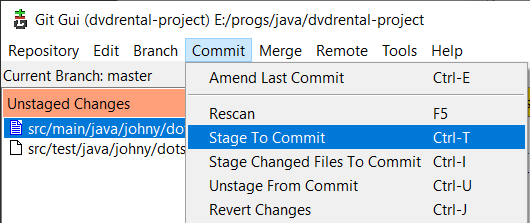
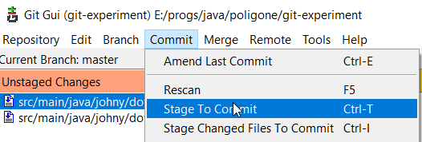
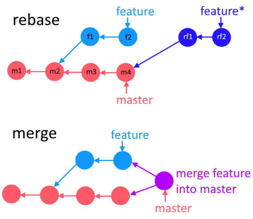

# Манипуляции с файлами

## Добавить\удалить файл в стейдж

Выбираем файл, далее в главном меню *Commit > Stage To Commit*



Можно и через консоль, но это менее удобно, если файлы лежат глубоко:

```
git add src/main/java/johny/dotsville/App.java
```

Добавить все файлы в стейдж:

```
git add .
```

Удалить файл из стейджа:

```
git restore --staged some/file.c
```

## Откатить изменения в файле

> Касается измений, которые еще не закоммичены, а просто набраны в файле. Для отката закоммиченных изменений используется команда `git reset`

Если файл находится в стейдже, сначала убираем его оттуда (если он еще не в стейдже, эта команда, соответственно, не нужна и можно сразу пользоваться второй командой):

```
git restore --staged some/file.c
```

Потом уже отменяем изменения, сделанные после последнего коммита:

```
git restore some/file.c
```

## Откатить изменения во всех файлах

Если нужно отменить все незакоммиченные изменения во *всех* файлах:

```
git reset --hard
```


## ??? тайник

# Коммиты

## Обычный коммит с сообщением

```
git commit -m "Что сделано, то сделано, чего бухтеть-то?"  // Если сообщение короткое
git commit  // Если сообщение большое и удобнее ввести его через vi
```

## Частичный коммит

Пользуемся для этого `git gui`. Выделяем фрагмент, который хотим закоммитить (нужно выделять как добавленные строки, так и удаленные), *ПКМ > Stage Lines For Commit*

## Прибавить код к последнему коммиту

```
... // Сначала добавляем изменения в стейдж
git commit --amend --no-edit  // Если не хотим менять сообщение у коммита
git commit --amend -m "Если хотим изменить сообщение и оно короткое"
git commit --amend  // Если сообщение сложное и хотим ввести его через vi
```

Применять эту команду нужно исключительно к локальным коммитам

## Изменить сообщение к последнему коммиту

```
// НЕ добавляем никаких файлов в стейдж!
git commit --amend -m "Новое сообщение заменит старое"
git commit --amend  // Если хотим редактировать сообщение в vi
```

Применять эту команду нужно исключительно к локальным коммитам

## Объединить коммиты

Делается через интерактивный rebase, см. раздел про ребейз

## Откатиться на указанный коммит с удалением изменений

Все, что было *после* указанного коммита - исчезнет (cb42b1650 - начальная часть id коммита):

```
git reset cb42b1650 --hard
```


# Ветки

## Список всех веток

```
git branch
```

Покажет все существующие ветки и на какой мы находимся в данный момент. Показывает только локальные ветки.

```
git branch -a
```

Показать не только локальные, но и remote ветки.

## Узнать текущую ветку

```
git branch
git status
```

Первая покажет список всех веток и выделит звездочкой текущую. А вторая показывает общее состояние репозитория (какие файлы добавлены, удалены, модифицированы) и заодно текущую ветку.

## Создать ветку от текущей

И сразу переключиться на нее:

```
git checkout -b "feature/persistence"
```

Без переключения:

```
git branch "feature/persistence"
```

## Создать ветку от другой ветки или коммита

Создадим ветку с названием dev-based от ветки dev:

```
git branch dev-based dev
```

Создадим ветку от определенного коммита (при этом достаточно нескольких первых символов id коммита и это может быть абсолютно любой коммит):

```
           имя новой ветки                id коммита
git branch feature/persistence-a81e-based a81e8c7397
```

## Переключиться на ветку

```
git checkout "features/f1"
```

## Удалить ветку

??? Нужно ли находиться на другой ветке, чтобы удалить текущую?

Удалить ветку с проверкой, влита ли она в "родительскую". Если нет, не удалится:

```
git branch --delete feature/f1  // Или просто -d
```

Удалить ветку, несмотря ни на что:

```
git branch --delete --force feature/f1  // Или просто -D
```

# Тайник


# Merge-слияние

## Простое слияние

```
git checkout master   // Сначала переключаемся на ветку, -В- которую хотим влить изменения
git merge feature/f1  // Указываем ветку, -ИЗ- которой берем код
```

## Слияние с конфликтом

Если есть конфликты, то в git gui и прочих графических клиентах конфликтные места в файлах выглядят примерно так:


А в самом файле с исходниками вот так (маркеры реально добавляются в исходники, т.е. это не просто визуальная хрень):

```java
public class Person {
<<<<<<< HEAD
    private String fullname;
    private LocalDate birth;

    public Person(String fullname, LocalDate birth) {
        this.fullname = fullname;
=======
    private String username;
    private LocalDate birth;

    public Person(String username, LocalDate birth) {
        this.username = username;
>>>>>>> features/f1
        this.birth = birth;
    }
}
```

Между маркером `<<<<<<< HEAD` и `=======` видим проблемный участок так, как он выглядит в ветке *В* которую мы вливаем. А между маркером `=======` и `>>>>>>> features/f1` то, как он выглядит в ветке *ИЗ* которой забираем код.

При конфликте команда `git status` показывает конфликтующие файлы и подсказки с актуальными командами:

```
On branch master
You have unmerged paths.
  (fix conflicts and run "git commit")
  (use "git merge --abort" to abort the merge)

Unmerged paths:
  (use "git add <file>..." to mark resolution)
        both modified:   src/main/java/johny/dotsville/App.java
        both modified:   src/main/java/johny/dotsville/Person.java

no changes added to commit (use "git add" and/or "git commit -a")
```

Для устранения конфликта необходимо:

* Открыть конфликтный файл в любом редакторе, например, в своей IDE, найти проблемные места

* Решить, какой код в итоге нам нужен, и разместить его между маркерами `<<<<<<< HEAD` и `>>>>>>> features/f1`

* Удалить маркеры вручную (просто стереть эти строки с `<<<<<` и `>>>>>`)

* Таким же образом обработать все конфликтные файлы

* Добавить обработанные файлы в стейдж

  Если через консоль, то командой `git add`, а если через git gui, то через меню:

  

* Сделать коммит - это будет *коммит слияния* (т.н. "merge-commit"), и у него будет два родителя

  Можно коммитить либо через консоль, либо через git gui, там есть окно для ввода комментария к коммиту.

## Прекратить слияние при конфликте

Если все пошло совсем не по плану и решить конфликт не удается, можно вызвать `git status` и увидеть там подсказку, что остановить слияние и вернуть текущую ветку в состояние до слияния можно вот такой командой:

```
git merge --abort
```


# Rebase-слияние

## Механика ребейза

При выполнении rebase меняется *базовый* коммит фичеветки. Т.е. если фичеветка изначально началась от коммита m2, то после ребейза ее базовым коммитом будет последний коммит мастера (m4). При этом операция заключается не просто в изменении указателя родительского коммита в f1, а в создании абсолютно новых коммитов rf1 и rf2, которые содержат код из f1 и f2 с учетом кода из и m4. И если будут конфликты между m4 и кодом из новых коммитов, придется их решить.

Поскольку ребейз сам по себе не вливает фичеветку в мастер, все равно придется потом сделать merge фичеветки. Просто после свежего ребейза merge выполнится путем fast-forward, без образования merge-коммита.




## Выполнение ребейза и конфликты

Чтобы выполнить ребейз:

* Переходим на фичеветку

* Выполняем

  ```
  git rebase somemaster
  ```

* Решаем конфликты, если они есть

Так выглядит конфликт при ребейзе - в нижнем маркере показан конкретный коммит, вызвавший конфликт:

```java
public class Person {
<<<<<<< HEAD
    private String name1337;
=======
    private String name;  // Поменял имя на нормальное
>>>>>>> de6e0ef (Моделируем ситуацию конфликта)
}
```

> Когда-то у меня сложилось впечатление, будто ребейз заставил меня двадцать раз решать один и тот же конфликт. Не помню как такое вышло, воспроизвести не получилось. Так что сейчас я говорю, что один конфликт нужно решить единожды

В целом ситуация с конфликтами решается похожим на merge образом - смотрим подсказки гита:

```
Auto-merging src/main/java/johny/dotsville/Person.java
CONFLICT (content): Merge conflict in src/main/java/johny/dotsville/Person.java
error: could not apply de6e0ef... Моделируем ситуацию конфликта
hint: Resolve all conflicts manually, mark them as resolved with
hint: "git add/rm <conflicted_files>", then run "git rebase --continue".
hint: You can instead skip this commit: run "git rebase --skip".
hint: To abort and get back to the state before "git rebase", run "git rebase --abort".
Could not apply de6e0ef... Моделируем ситуацию конфликта
```

```
interactive rebase in progress; onto eece732
Last command done (1 command done):
   pick de6e0ef Моделируем ситуацию
Next commands to do (2 remaining commands):
   pick b36ef7c Готовим несоответствия
   pick 0d37910 Тестирование
  (use "git rebase --edit-todo" to view and edit)
You are currently rebasing branch 'feat/f1' on 'eece732'.
  (fix conflicts and then run "git rebase --continue")
  (use "git rebase --skip" to skip this patch)
  (use "git rebase --abort" to check out the original branch)

Unmerged paths:
  (use "git restore --staged <file>..." to unstage)
  (use "git add <file>..." to mark resolution)
        both modified:   src/main/java/johny/dotsville/Person.java

no changes added to commit (use "git add" and/or "git commit -a")
```

* Правим исходники
* Через `git add` добавляем исправленные файлы в стейдж
* Выполняем `git rebase --continue`
* Решаем следующий конфликт и так пока ребейз не закончится
* Если запутались, `git rebase --abort`
* Когда все закончили, переходим на главную ветку и делаем `git merge features/f1`, merge выполнится через fast-forward и получится ровная история без merge-коммита

## Интерактивный ребейз

ыфв

# Сброс изменений и reset


## Наблюдения

* Через git reset можно переставить указатель фичеветки вообще на любой коммит, даже если он в параллельной ветке, с которой текущая никак не пересекается. Правда актуальность под вопросом.


# Вещи, которые регулярно забываются

Есть некоторые вещи, которые регулярно забываются и вызывают вопросы.

* Мы изменили в фичеветке какое-то место, которое не менялось в ушедшем вперед мастере.

  Допустим, в мастере был класс с полем *name*. Мы сделали ветку и поменяли название этого поля на *fullname*. В это время мастер ушел на несколько коммитов вперед, и это поле в них не трогали. При вливании фичеветки в мастер, будет ли конфликт от того, что у нас оно называется *fullname*, а там - просто *name*?

  Ответ: нет, конфликта не будет, т.к. на момент слияния изменения были только в одном месте - в фичеветке, поэтому старое значение просто поменяется на новое. А вот если в этих ушедших вперед коммитах поле *name* тоже поменяют, например, на *username*, тогда конфликт будет, из-за того, что изменения в двух местах, и придется выбрать, какой вариант использовать в итоге.

# Вопросы

Что такое squash? Это вроде какой-то параметр commit

Тэги (tag) и ветки?

git log

git bisect