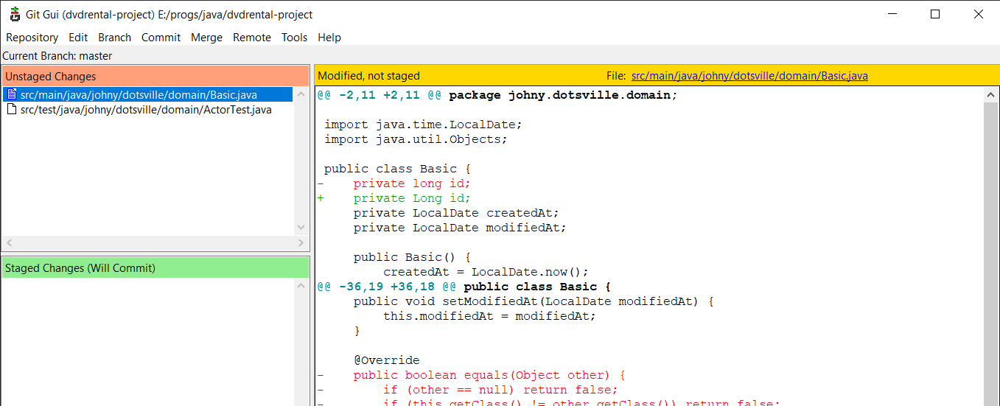

# Графический клиент

Команда для запуска дефолтного графического клиента:

```
git gui
```

Весьма удобный клиент, с его помощью можно делать частичный коммит, просматривать историю коммитов.




## Настройки

### Кодировка

Если в окне русские буквы отображаются некорректно, заходим в главном меню *Edit > Options*, ищем настройку *Default File Contents Encoding* и меняем на UTF-8.

# Сценарии

## Добавить файл в коммит

Выбираем файл, далее в главном меню *Commit > Stage To Commit*


## Частичный коммит

Выделяем фрагмент, который хотим закоммитить (удаленные и добавленные строки), *ПКМ > Stage Lines For Commit*


## Создать новую ветку

И сразу переключиться на нее:

```
git checkout -b "feature/persistence"
```

