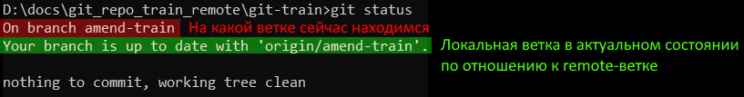
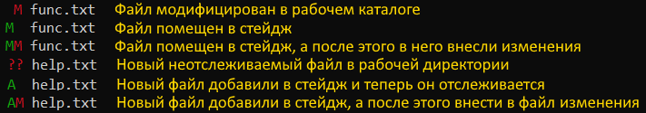

# Состояния файлов

* `Untracked` - это все файлы в рабочей директории, которые не находятся под надзором гита.
* `Unmodified` - файлы под надзором гита, в которых не было изменений с момента последнего коммита.
* `Modified` - в файлах есть незакоммиченные изменения.
* `Committed` - файлы сохранены в репозиторий.
* `Staged` - файлы подготовлены к коммиту. В коммит они попадут именно в том виде, какой был на момент помещения в стейдж. Если после этого файлы снова изменить и не добавить в стейдж еще раз, то эти новые изменения не попадут в коммит (на примере показано в разделе про стейдж).

Графически схема переходов выглядит так:


P.S. Я бы еще добавил стрелку от Staged до Modified в случае внесения изменений в файл после помещения его в стейдж. Может быть технически такая стрелка и не очень корректна, зато на практике есть такой момент.

TODO: перерисовать картинку в drawio

## Как посмотреть состояние

* Полноформатный вывод:

  ```
  git status
  ```

* Краткоформатный вывод:

  ```
  git status -s
  git status --short
  ```

### Полноформатный вывод

* Нет неотслеживаемых файлов, нет изменений в отслеживаемых файлах:

  

* В рабочей директории есть файл func.txt, не находящийся под надзором гита:

  

  Такое получается когда мы помещаем в рабочую директорию новый файл.

* Файл func.txt помещен в стейдж и теперь под надзором гита, но еще не закоммичен:

  

  Такое получается, когда мы командой `git add func.txt` заставляем гит отслеживать новый файл.

* Файл func.txt помещен в стейдж, но после этого файл модифицировали. Если повторно не положить его в стейдж, но последние изменения в коммит не попадут:

  

* Отслеживаемый файл модифицирован:

  

### Краткоформатный вывод



Расшифровка букв:

* `A` - added, новый файл, который гит отслеживает.
* `M` - modified, измененный файл.
* `?` - неотслеживаемый гитом файл.
* `D` - deleted, удаленный файл. Когда мы удаляем из рабочей директории файл, гит понимает, какой файл мы удалили. Если удаление еще не закоммичено, то можно файл восстановить командой `git restore filename.txt`, но это уже другая история.

Маркер состоит из двух столбиков:

* Левый - состояние стейджа.
* Правый - состояние рабочей директории.

По описаниям комбинаций со скрина вроде бы можно додуматься что все это значит, но тем не менее дополнительные комментарии:

* `_M` - справа М, значит в рабочей директории есть модифицированный файл. Слева ничего, значит эти изменения не помещены в стейдж.
* `M_` - слева М, значит изменения этого файла помещены в стейдж. Поскольку справа ничего, значит после помещения в стейдж этот файл больше не трогали.
* `MM` - слева М, значит файл изменили и положили в стейдж. Справа тоже М, значит файл опять меняли после того как положили в стейдж и эти изменения в коммит не попадут, если их не положить еще раз в стейдж.

