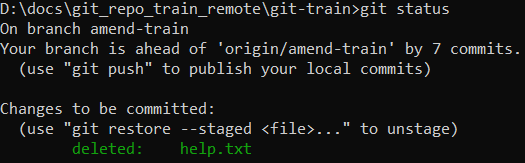
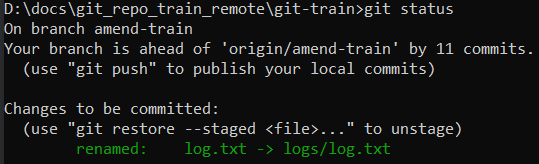
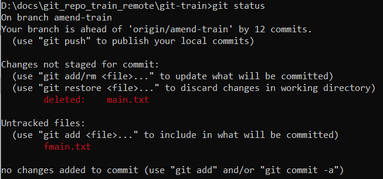

## Имя файла

TODO: Вместо имени файла или директории можно использовать шаблон.

# Удаление файла с диска

Удаление файла происходит в два этапа - удаление и коммит. Удалить его можно как средствами файловой системы (через проводник например), так и командой гита.

## Удаление "через проводник"

* Удаляем файл через проводник. git status в этом случае покажет следующее:

  

* Кладем "удаление" в стейдж:

  ```
  git add log.txt  ; или git rm log.txt
  ```

  Может быть выглядит немного странно, но с технической точки зрения все правильно: любые изменения рабочего каталога, которые мы хотим закоммитить, сначала нужно отправить в стейдж.

* Коммитим:

  ```
  git commit -m "Удалил файл log.txt"
  ```

  P.S. Можно было бы сделать одной командой:

  ```
  git commit -a -m "Удалил файл log.txt"
  ```

  Про флаг `-a` см конспект про коммиты.

## Удаление командой гита

* Удаляем файл:

  ```
  git rm log.txt
  ```

  При этом удаление сразу оказывается в стейдже:

  

* Коммитим:

  ```
  git commit -m "Удалил файл log.txt"
  ```

# Восстановление

Восстановить файл можно только пока удаление не закоммичено. Сценария два: удаленный файл уже в стейдже или еще нет.


* Если уже в стейдже:

  ```
  git restore --staged log.txt  ; Сначала вытаскиваем операцию "удаления" из стейджа
  git restore log.txt           ; Теперь отменяем удаление и файл возвращается в рабочую директорию
  ```

* Если еще не в стейдже:

  ```
  git restore log.txt
  ```

# Перестать отслеживать файл

* Убираем файл из отслеживаемых с помощью той же команды `rm` и флага `--cached`:

  ```
  git rm --cached log.txt
  ```

  git status показывает это так:

  

* Коммитим свое намерение перестать отслеживать:

  ```
  git commit -m "Перестали отслеживать log.txt"
  ```


# Переименовать файл

## Как работает переименование

Переименование файла для гита выглядит как комбинация трех команд: клонировать файл под новым именем, перестать отслеживать старый файл, начать отслеживать новый. В линуксовых терминах:

```
mv README.md README
git rm README.md
git add README
```

## Переименование командой гита

* Переименовываем файл командой `mv`:

  ```
  git mv log.txt logs/log.txt
  ```

  Здесь не просто переименование, но и еще перемещение в другую директорию (директория должна существовать). git status выглядит так:

  

* Коммитим:

  ```
  git commit -m "Переименовал log.txt с помощью команды mv"
  ```

## Переименование "через проводник"

* Переименовываем файл средствами файловой системы, например через проводник. git status это показывает так:

  

* Коммитим:

  ```
  git commit -a -m "Переименовали main.txt средствами файловой системы"
  ```

  P.S. Здесь есть нюанс. Как видно из git status, у нас образуется две операции - удаление main.txt и неотслеживаемый новый файл fmain.txt. Если выполнить подряд команды `git add fmain.txt` и `git add main.txt` (или разом сделать `git add .`), то git status покажет тот же самый вывод, как и при использовании mv (`renamed: name1 -> name2`). Если же выполнить только одну команду `git add`, то вторая операция как бы подвиснет в воздухе. Поэтому при работе из консоли лучше переименовывать командой `mv`. Ну а при использовании проводника, что конечно же удобнее для перемещения и переименования, просто пользуемся `git add .`

