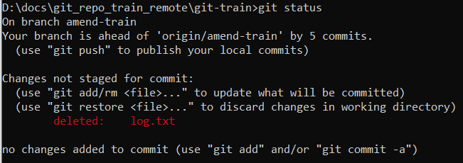
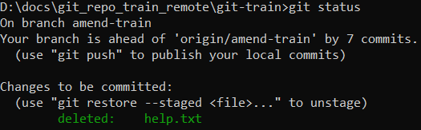

# Удаление файла с диска

Здесь речь идет об удалении файла с диска и из базы гита. Удаление файла происходит в два этапа - удаление и коммит. Удалить его можно как средствами файловой системы (через проводник например), так и командой гита.

## Удаление "через проводник"

* Удаляем файл через проводник. git status в этом случае покажет следующее:

  

* Индексируем удаление:

  ```
  git add log.txt
  ```

  Может быть выглядит немного странно, но с технической точки зрения все правильно: любые изменения рабочего каталога, которые мы хотим закоммитить, сначала нужно отправить в индекс. Я попытался описать эту механику в конспекте "движения файла, add vs restore".

* Коммитим:

  ```
  git commit -m "Удалил файл log.txt"
  ```


## Удаление командой гита

* Удаляем файл:

  ```
  git rm log.txt
  ```

  При этом удаление сразу оказывается в индексе:

  

* Коммитим:

  ```
  git commit -m "Удалил файл log.txt"
  ```

# Восстановление

Сценария три: 

* Удаление уже в индексе.
* Удаление еще не в индексе.
* Удаление уже закоммичено.

Решение:

* Если уже в индексе:

  ```
  git restore --staged log.txt  ; Сначала восстанавливаем файл из ласт коммита в индекс.
  git restore log.txt           ; Теперь восстанавливаем файл из индекса в рабочку.
  ```

* Если еще не в индексе:

  ```
  git restore log.txt  ; Восстанавливаем файл из индекса в рабочку.
  ```
  
* Если удаление закоммичено, то мы можем найти какой-нибудь коммит, где нужный файл присутствует, и восстановить его, указав хэш коммита:

  ```
  git restore --source=ab34fe7 log.txt
  ```

В принципе, если удаление уже находится в индексе, то все равно можно восстановить файл в рабочке сразу из коммита. Но тогда удаление останется в индексе. При добавлении восстановленного файла в индекс удаление заменится добавлением и в итоге все будет норм. Но для избежания путаницы можно делать последовательно - сначала восстановить из коммита в индекс, а потом из индекса в рабочку. А если ничего не понятно, что в этом абзаце написано - см конспект "движение файла, add vs restore", там про механику рассказано.