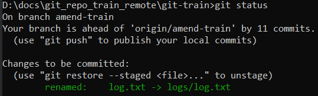
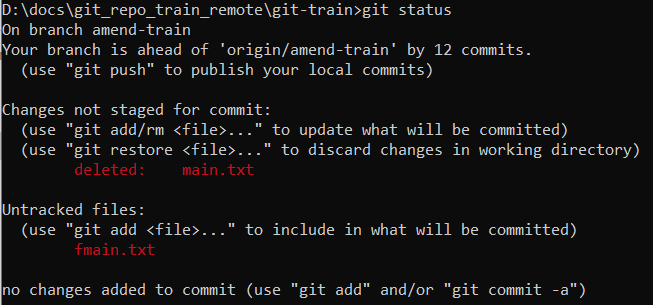

# Как работает переименование

Переименование файла для гита выглядит как комбинация трех команд: клонировать файл под новым именем, перестать отслеживать старый файл, начать отслеживать новый. В линуксовых терминах:

```
mv README.md README
git rm README.md
git add README
```

# Переименование командой гита

* Переименовываем файл командой `mv`:

  ```
  git mv log.txt logs/log.txt
  ```

  Здесь не просто переименование, но и еще перемещение в другую директорию (директория должна существовать). git status выглядит так:

  

* Коммитим:

  ```
  git commit -m "Переименовал log.txt с помощью команды mv"
  ```

# Переименование "через проводник"

* Переименовываем файл средствами файловой системы, например через проводник. git status это показывает так:

  

* Коммитим:

  ```
  git commit -a -m "Переименовали main.txt средствами файловой системы"
  ```

  P.S. Здесь есть нюанс. Как видно из git status, у нас образуется две операции - удаление main.txt и неотслеживаемый новый файл fmain.txt. Если выполнить подряд команды `git add fmain.txt` и `git add main.txt` (или разом сделать `git add .`), то git status покажет тот же самый вывод, как и при использовании mv (`renamed: name1 -> name2`). Если же выполнить только одну команду `git add`, то вторая операция как бы подвиснет в воздухе. Поэтому при работе из консоли лучше переименовывать командой `mv`. Ну а при использовании проводника, что конечно же удобнее для перемещения и переименования, просто пользуемся `git add .`

