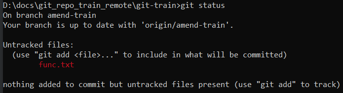

# Краткий формат

```
git status -s
git status --short
```

Как выглядит в консоли:


Маркер состояния включает два столбика:

* Левый - состояние стейджа (индекса).
* Правый - состояние рабочей директории.

Расшифровка букв:

* `?` - неотслеживаемый гитом файл.
* `A` - added, новый файл, который гит отслеживает.
* `M` - modified, измененный файл.
* `D` - deleted, удаленный файл. Когда мы удаляем из рабочей директории файл, гит понимает, какой файл мы удалили. Если удаление еще не закоммичено, то можно файл восстановить командой `git restore filename.txt`, но это уже другая история.

TODO: там больше маркеров, потом можно разобраться.

Дополнительные объяснения формата маркера:

* `_M` - справа М, значит в рабочей директории есть модифицированный файл. Слева ничего, значит эти изменения не помещены в стейдж.
* `M_` - слева М, значит изменения этого файла помещены в стейдж. Поскольку справа ничего, значит после помещения в стейдж этот файл больше не трогали.
* `MM` - слева М, значит файл изменили и положили в стейдж. Справа тоже М, значит файл опять меняли после того как положили в стейдж и эти изменения в коммит не попадут, если их не положить еще раз в стейдж.


# Полный формат

```
git status
```

* Нет неотслеживаемых файлов, нет изменений в отслеживаемых файлах:

  

* В рабочей директории есть файл func.txt, не находящийся под надзором гита:

  

  Такое получается когда мы помещаем в рабочую директорию новый файл.

* Файл func.txt помещен в стейдж и теперь под надзором гита, но еще не закоммичен:

  

  Такое получается, когда мы командой `git add func.txt` заставляем гит отслеживать новый файл.

* Файл func.txt помещен в стейдж, но после этого файл модифицировали. Если повторно не положить его в стейдж, то последние изменения в коммит не попадут:

  

* Отслеживаемый файл модифицирован:

  

