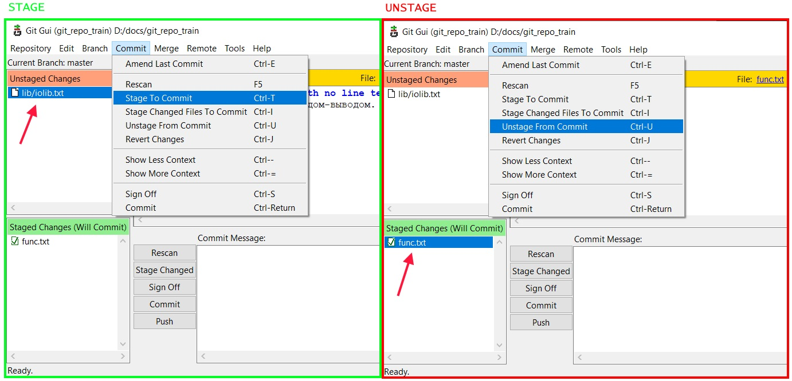

# Через консоль

## Добавить

Добавление в стейдж делается командой `git add`:

* Добавить один конкретный файл:

  ```
  git add src/main/java/johny/dotsville/App.java
  ```

* Добавить все файлы, которые есть в рабочей директории и ее подпапках:

  ```
  git add .
  ```

## Удалить

Удаление из стейджа делается командой `git restore`:

* Удалить конкретный файл \ директорию из стейджа:

  ```
  git restore --staged some/file.c
  ```
  
  ```
  git restore --staged some/  ; Удалить из стейджа всю директорию some/
  ```
  
* Удалить всё из стейджа - и файлы, и директории:

  ```
  git restore --staged .
  ```

# Через GUI

* Добавление. Выбираем файл в секции `Unstaged changes`, далее в главном меню `Commit > Stage to Commit`

* Удаление. Выбираем файл в секции `Staged changes`, далее в главном меню `Commit > Unstage from Commit`



