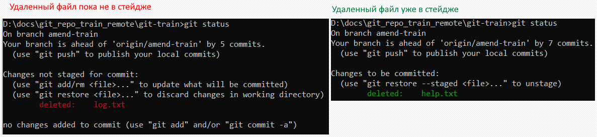

# Имя файла

TODO: Вместо имени файла или директории можно использовать шаблон.

# Удаление файла с диска

Удаление файла происходит в два этапа - удаление и коммит. Удалить его можно как средствами файловой системы (через проводник например), так и командой гита.

## Удаление "через проводник"

* Удаляем файл через проводник. git status в этом случае покажет следующее:

  

* Кладем "удаление" в стейдж:

  ```
  git add log.txt  ; или git rm log.txt
  ```

  Может быть выглядит немного странно, но с технической точки зрения все правильно: любые изменения рабочего каталога, которые мы хотим закоммитить, сначала нужно отправить в стейдж.

* Коммитим:

  ```
  git commit -m "Удалил файл log.txt"
  ```

  P.S. Можно было бы сделать одной командой:

  ```
  git commit -a -m "Удалил файл log.txt"
  ```

  Про флаг `-a` см конспект про коммиты.

## Удаление командой гита

* Удаляем файл:

  ```
  git rm log.txt
  ```

  При этом удаление сразу оказывается в стейдже:

  

* Коммитим:

  ```
  git commit -m "Удалил файл log.txt"
  ```

# Восстановление

Восстановить файл можно только пока удаление не закоммичено. Сценария два: удаленный файл уже в стейдже или еще нет.



* Если уже в стейдже:

  ```
  git restore --staged log.txt  ; Сначала вытаскиваем операцию "удаления" из стейджа
  git restore log.txt           ; Теперь отменяем удаление и файл возвращается в рабочую директорию
  ```

* Если еще не в стейдже:

  ```
  git restore log.txt
  ```

