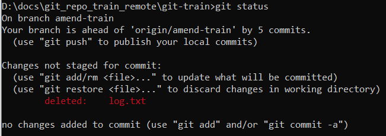

# Удаление файла с диска

Здесь речь идет об удалении файла с диска и из базы гита. Удаление файла происходит в два этапа - удаление и коммит. Удалить его можно как средствами файловой системы (через проводник например), так и командой гита.

## Удаление "через проводник"

* Удаляем файл через проводник. git status в этом случае покажет следующее:

  

* Кладем "удаление" в стейдж:

  ```
  git add log.txt
  ```

  Может быть выглядит немного странно, но с технической точки зрения все правильно: любые изменения рабочего каталога, которые мы хотим закоммитить, сначала нужно отправить в стейдж.

* Коммитим:

  ```
  git commit -m "Удалил файл log.txt"
  ```


## Удаление командой гита

* Удаляем файл:

  ```
  git rm log.txt
  ```

  При этом удаление сразу оказывается в стейдже:

  

* Коммитим:

  ```
  git commit -m "Удалил файл log.txt"
  ```

# Восстановление

Сценария три: 

* Удаление уже в индексе.
* Удаление еще не в индексе.
* Удаление уже закоммичено.


* Если уже в индексе:

  ```
  git restore --staged log.txt  ; Сначала удаляем операцию "удаления" из индекса
  git restore log.txt           ; Теперь отменяем удаление и файл возвращается в рабочую директорию
  ```

* Если еще не в индексе:

  ```
  git restore log.txt
  ```
  
* Если удаление закоммичено, то мы можем найти какой-нибудь коммит, где нужный файл присутствует, и восстановить его, указав хэш коммита:

  ```
  git restore --source=ab34fe7 foobar/Person.ts
  ```

По сути, восстанавливать удаленный файл - это как восстанавливать содержимое измененного файла. Принципы те же самые, команда та же самая, git restore. Отличается только то, что если удаление заиндексировано, то его сначала надо из индекса убрать, прежде чем получится восстановить файл в рабочей директории.

