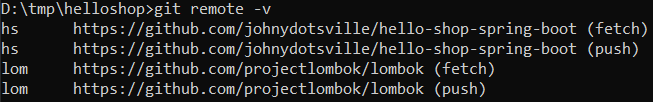
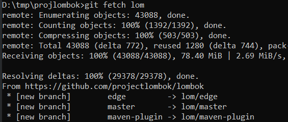
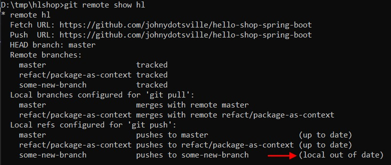

# Связь с удаленным репо

Чтобы установить связь с удаленным репо:

* Создаем локальный репозиторий в какой-нибудь директории:

  ```
  mkdir /somewhere/foobar
  cd /somewhere/foobar
  git init
  ```

* Связываем этот новый репозиторий с каким-нибудь удаленным командой `git remote add`:

  ```
  git remote add lom https://github.com/projectlombok/lombok
  ```

  Здесь lom - это псевдоним репо, который мы придумываем сами чтобы ссылаться на этот репо. Ну а дальше идет ссылка на remote-репо.

P.S. Можно так связать локальный репо с несколькими удаленными, но на данный момент я не знаю зачем это нужно.

# Просмотр связанных репо

Надо находиться в директории репозитория.

```
git remote
```

```
git remote -v
```

Флаг `-v` покажет не только псевдоним удаленного репо, но и url.



# Вытягиваем репо себе

## git fetch

Надо находиться в директории репозитория. Команда fetch просто вытягивает из удаленного репо все к нам в локальный, но не занимается мёржем. Поэтому если создать новый локальный репо и просто вытянуть себе из удаленного, то рабочая директория останется пустой. Fetch хорошо использовать, чтобы вытащить себе все изменения, которые произошли в удаленном репо с момента прошлого вытягивания, но при этом чтобы эти изменения не пытались сию минуту влиться в нашу рабочую директорию.

```
git fetch lom  ; lom - это псевдоним репо, который мы ему дали при настройке связи.
```



Для справки (TODO: мб здесь будут неточности, так что надо вернуться сюда позже. Пишу сейчас чисто чтобы привлечь к этому моменту внимание): на скрине выше показаны ветки, которые к нам вытянулись. Но если сейчас набрать `git branch`, то мы увидим пустой список. Все потому, что надо начать ветки отслеживать. Набираем, например `git checkout master` и тогда уже ее содержимое помещается нам в рабочую директорию и локальный гит видит эту ветку.

## git clone

Клонирование работает так:

* Создается локальный репо.
* Удаленному репо автоматически присваивается псевдоним `origin`.
* Выполняется fetch + в рабочей директории появится содержимое ветки master.

```
cd /somewhere/foobar
git clone https://github.com/projectlombok/lombok.git
```

# Пушим ветки в удаленный репо

```
git push --set-upstream lom some-new-branch
```

Пока не знаю что это значит. Наверное об этом будет подробнее в разделе ветвления.

Кроме того, работает банальное безо всяких апстримов:

```
git push lom some-new-branch
```


# Узнаем что нового в удаленном репо

```
git remote show lom
```



# Вытягиваем изменения ветки себе


```
git pull hl some-new-branch
```


# TODO

* Написать про `git pull`.
* Вероятно, можно дать алиас ветке и работать с ней через алиас. Грубо говоря, если удаленная ветка имеет длинное поехавшее название, то можно затрекать ее под своим удобным именем. Пока это только догадка, но мне кажется такое возможно. Дописать сюда, когда найду как.
* Вообще сюда бы поместить все, что связанно с удаленной работой, в т.ч. относящееся к веткам.