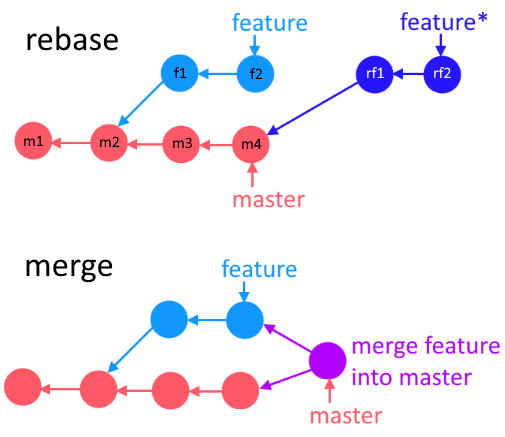

# Механика ребейза

При выполнении rebase меняется *базовый* коммит фичеветки. Т.е. если фичеветка изначально началась от коммита m2, то после ребейза ее базовым коммитом будет последний коммит мастера (m4). При этом операция заключается не просто в изменении указателя родительского коммита в f1, а в создании абсолютно новых коммитов rf1 и rf2, которые содержат код из f1 и f2 с учетом кода из и m4. И если будут конфликты между m4 и кодом из новых коммитов, придется их решить.

Поскольку ребейз сам по себе не вливает фичеветку в мастер, все равно придется потом сделать merge фичеветки. Просто после свежего ребейза merge выполнится путем fast-forward, без образования merge-коммита.

