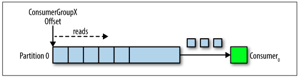
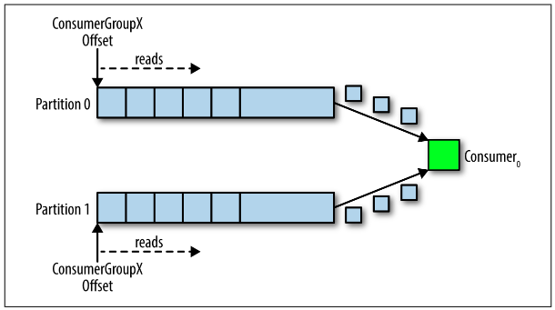
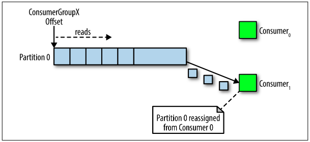

Здесь я попытался описать основы. Самое важное вкратце обо всем, чтобы можно быстро сориентироваться, получить общую картину и дальше разбираться более детально.

# Терминология

* Event Streaming - примерно переводится как *потоковая передача событий*.  Это *непрерывный сбор данных* от источников, *хранение* этих данных для дальнейшего извлечения, манипуляций и перенаправления в другие точки назначения.
* Распределенная система - означает, что "программа" состоит из множества своих экземпляров, которые хоть и работают на разных серверах, но функционируют как единое целое.

# Общая архитектура Kafka

Кафка является распределенной системой потокового обмена сообщениями.

## Серверная часть, брокеры, кластер

Серверная часть - это по сути слой хранения данных. Он состоит из *брокеров*. Каждый брокер занимает целиком сервер (или виртуальную машину), т.е. на одном сервере не может работать несколько брокеров. Итого можно сказать, что брокер - это один сервер кафки.

Брокеры могут объединяться в *кластеры* и работать как единая система.

## Клиентская часть, производители и потребители

К клиентской части относятся *производители* (Producer, далее Pro) и *потребители* (Consumer, далее Con). Производители отправляют сообщения брокеру, а потребители забирают сообщения у брокера. Таким образом, Pro и Con непосредственно не завязаны друг на друга, что дает системе гибкость.

## ZooKeper

Это вспомогательная система (тоже распределенная), которая снимает с кафки часть "рутинной" нагрузки, что позволяет кафке работать быстрее. Как пример такой рутины - ZooKeeper при репликации партиций дает кафке информацию, какая партиция является лидер-партицией (об этом будет дальше).

# Организация данных

## Сообщения

Сообщение (оно же событие, запись, record и т.д.) - это единица данных, которые хранят брокеры. Концептуально сообщение содержит три части:

* Ключ - имеет важное значение, поскольку влияет на то, в какую *партицию* попадет сообщение. О партициях и как именно ключ влияет на расположение, подробнее будет дальше. Вкратце - сообщения с одинаковым ключом гарантированно попадают  в одну партицию.
* Значение - полезная нагрузка сообщения. Собственно говоря, это и есть непосредственно данные.
* Временная отметка - время поступления сообщения в систему.

## Топики, партиции

Приходящие сообщения хранятся в `топиках` (topic). Топиков может быть много и таким образом организуется *логическая* группировка сообщений. Например, топик может хранить сообщения, связанные с каким-нибудь процессом: пользователь залогинился, зашел в сообщения, открыл такое-то сообщения, удалил такое-то, добавил песню в плейлист, разлогинился. Все эти события будут сохранены друг за другом, формируя *очередь*. 

Каждый топик делится на `партиции` (partitions). Если топик - это по сути логическое понятие, то партиция уже имеет физическую природу - это файл на диске, страницы в оперативной памяти, не столь важно, главное что партиция хранит данные. Партиций может быть от одной и до бесконечности (теоретически). Партиции задают уровень параллелизма *чтения* сообщений, но об этом позже. Очень важная особенность - сообщения с одинаковым ключом всегда попадают в одну партицию и за счет этого сообщения читаются в том же порядке, в каком были записаны.

Поскольку кафка - распределенная система, то нет такого, что какой-то брокер хранит полный набор данных. Партиции "размазаны" по брокерам (не данные партиций, а сами партиции). Например, если у нас два брокера, и топик из 5 партиций, то три партиции будут храниться на одном брокере, а оставшиеся две - на другом.

Итого, топик можно представить как логически общую очередь сообщений, состоящую из нескольких конкретных физических очередей, количество которых может быть от одной и больше. Иногда топик называют `журналом коммитов`.

> Можно придраться к термину очередь, т.к. "классическая" очередь предполагает удаление элемента данных после чтения, а кафка не удаляет (об этом дальше, в архитектуре чтения). Ну а если не придираться, то слово очередь подходит хорошо.

## Репликация, лидер-партиция

`Репликация` - это способ повысить надежность хранения за счет копирования партиций на несколько брокеров. Для наглядности разберем репликацию на примере, когда у нас есть три брокера и две темы, каждая из которых разбита на три партиции. В случае, если какой-то брокер отваливается, партиция остается доступна на двух других и работа продолжается.

Наличие трех брокеров фактически означает наличие трех серверов (или виртуальных машин), каждый со своим хранилищем. То есть максимум мы можем сделать три копии каждой партиции. Больше - бессмысленно, потому что тогда как минимум две копии окажутся на одном брокере и если он отвалится, то и они будут недоступны и не важно, две их было или десять.

Поставщики и потребители работают непосредственно с партициями, и если у нас будет три копии каждой партиции, то поставщик и потребитель должны работать только с одной из копий, чтобы не возникло неразберихи. Поэтому одна копия партиции назначается `главной (leader)` и поставщик и потребитель работают только с ней, а остальные копии являются подписчиками лидера и просто вытягивают себе изменения. Случай отвала брокера, хранящего лидер-партицию - отдельный разговор. Информацию о том, кто является лидер-партицией, кафке предоставляет ZooKeeper.

Если привести житейскую аналогию - представьте, что вы пишете диплом и для надежности сохранили копии в трех файлах, каждый из которых лежит на отдельном hdd. Когда в следующий раз вы захотите что-то дополнить \ исправить, вы должны взять какой-то из этих трех файлов, внести в него изменения, а потом синхронизировать их с другими файлами (либо скопировав файлы целиком, либо добавив изменения руками, не важно). Важно то, что если вы не проведете эту синхронизацию, а потом при внесении следующих доработок вдруг забудете, в какой файл добавляли в прошлый раз, и теперь добавите в другой, то у вас возникнут очевидные сложности. Поэтому вам проще всего будет решить заранее, что "Файл на диске D будет главным. Я всегда буду дописывать в него, а потом просто копировать его на диски E и F". Это упрощает схему.

# Метаданные

Перед разбором архитектуры чтения и записи нужно уяснить, что запись и чтение клиенты выполняют в лидер-партицию. Информация о том, какая партиция является лидером, сколько вообще в кластере брокеров, топиков, где лежат их партиции и т.д. - называется `метаданными`, т.е. это полная информация обо всем кластере в целом. Эта информация со временем может меняться (например, партиций может стать больше, могут добавиться брокеры), так что ее нельзя единожды задать где-то и читать всю дорогу.

Клиент должен получить эти метаданные от брокера. От какого именно? По-хорошему, любой брокер должен уметь отдать метаданные или как минимум их должно быть больше одного.

* Клиент выполняет первичное подключение (initial connection, bootstrap) к какому-нибудь брокеру из кластера. Этот брокер вернет клиенту метаданные со всей необходимой информацией.
* Клиент подключается уже к нужному брокеру \ брокерам, чтобы выполнять чтение \ запись.

# Архитектура чтения

## Потребители

Чтение сообщений осуществляют клиенты, называемые `потребителями` (consumer). Логически чтение происходит из топика, но поскольку топик физически состоит из партиций, то реальное чтение осуществляется из конкретной партиции. Когда потребитель подключается к топику, кафка сама назначает ему партицию, из которой он будет читать.

Если потребитель только один, а партиций в топике несколько (допустим две) - это не проблема. Потребитель может читать из них, например, по принципу round robin - сначала сообщение из первой, потом сообщение из второй, потом снова из первой и т.д.

Данные после чтения не удаляются, как бывает в некоторых других ES-системах. Они хранятся столько времени, сколько задано в настройках брокера. Количество данных на производительность не влияет, поэтому хранить их можно столько, сколько нужно.

В некоторых системах брокеры могут уведомлять потребителя о пришедших сообщениях. Но в кафке это не так - потребители сами непрерывно опрашивают брокеров на наличие сообщений.

## Consumer group

На деле, потребитель всегда входит в так называемую `группу потребителей` (consumer group, ConG), даже если он один. Группа потребителей, таким образом, это один или несколько *фактических* потребителей (объектов Con), которые *логически* формируют *единого* потребителя. При этом архитектура такова, что *только один* потребитель в группе может читать из конкретной партиции. Поэтому если топик состоит из одной партиции, а мы создадим группу из двух потребителей, то только один будет читать, а второй будет простаивать. ConG характеризуется идентификатором *group_id*.

Если же в группе меньше потребителей, чем партиций, то партиции равномерно распределятся между имеющимися потребителями. Например, если партиций 12, а потребителей 3, значит каждый потребитель будет читать из 4 партиций. Если один потребитель выйдет из строя, произойдет ребалансировка и каждый из оставшихся 2 потребителей будет читать из 6 партиций.

Итого, чтобы добиться оптимального параллелизма чтения, нужно сделать топик из нескольких партиций и организовать чтение группой, состоящей из такого же количества потребителей. Тогда к каждой партиции топика будет прикреплен отдельный потребитель и чтение будет одновременным.

Если у сообщений одинаковый ключ, значит все они будут лежать в одной партиции, а значит их обработкой будет заниматься один и тот же потребитель. На примере процесса "пользователь залогинился > зашел в сообщения > открыл такое-то сообщение > удалил такое-то > добавил песню в плейлист > разлогинился" это означает, что все события от пользователя с логином user1337 будут последовательно обработаны одним потребителем, они не перемешаются между несколькими потребителями.

## Offset

Чтобы ориентироваться, сколько сообщений прочитано, существует специальный указатель, называемый `оффсет` (offset). При чтении оффсет перемещается вперед, на следующее сообщение.

Оффсет формируется из топика + партиции + group_id. Пристальное внимание надо обратить на group_id в этой связке. Поскольку это id *группы потребителей*, это значит что оффсет относится не к конкретному потребителю из группы, а ко всей группе в целом. Поэтому, когда *конкретный* потребитель читает партицию, по сути *все остальные* потребители из группы становятся в курсе о прочитанных сообщениях. Так что если один потребитель из группы выйдет из строя и произойдет ребалансировка, то заменивший его товарищ сможет продолжить чтение с того же самого места.

Как видно на картинке, оффсет относится не к конкретному потребителю из группы, а к целой группе. Для двух групп и топика из 3 партиций всего будет создано 6 оффсетов - по оффсету на каждую партицию для каждой группы.

* Изначально потребитель может установить оффсет на начало очереди или на конец.
* Оффсет можно перепозиционировать, чтобы прочитать какие-то сообщения повторно.

## Сценарии чтения

Рассмотрим все описанные выше сценарии в графическом виде. Одинаковым цветом выделены физические потребители, входящие в одну логическую группу.

### 1ЛК(1ФК) - 1П

1 логический потребитель, состоящий из одного физического, и топик с одной партицией.

Тут все просто - у потребителя свой оффсет и он читает из одной партиции.

### 1ЛК(1ФК) - 2П

Один физический потребитель читает из топика с несколькими партициями.

В этом случае потребитель просто управляет двумя оффсетами, только и всего. Чтение может осуществляться, например, по принципу round robin.

### 2ЛК(1ФК) - 1П

2 логических потребитель, в каждом по одному физическому, и топик с одной партицией.

У каждого потребителя свой оффсет, поэтому они спокойно читают сообщения независимо.

### 1ЛК(2ФК) - 1П

Один логический потребитель, состоящий из двух физических, и топик с одной партицией.

Архитектура такова, что только один потребитель из группы может читать партицию. Физический потребитель, подключившийся последним, захватывает оффсет и начинает читать. Первый потребитель уже не может читать.

Предположительно это сделано ради упрощения параллелизма. Нет общего состояния - нет проблем в параллельности. Общим состоянием в данном случае является оффсет.

### 1ЛК(2ФК) - 2П

Логический потребитель, состоящий из двух физических, читает топик, состоящий из двух партиций.

Самый эффективный сценарий. Партиции распределяются между физическими потребителями один к одному и они читают параллельно каждый из своей партиции, управляя своим оффсетом.

### Вывод

Параллелизм чтения в кафке достигается за счет разбиения топика на партиции. Максимальная эффективность достигается, когда количество фактических потребителей в группе равно количеству партиций в топике. Если потребителей меньше, чем партиций, значит какому-то потребителю придется обрабатывать больше одной партиции. Если же потребителей больше, чем партиций, значит какие-то потребители будут простаивать.

## Ошибки при обработке

В процессе чтения позицию оффсета нужно регулярно коммитить в кафку в ее специальный внутренний топик `__consumer_offsets`. По умолчанию коммит происходит автоматически через указанный интервал (настройки enable.auto.commit = true, auto.commit.interval.ms = N), но можно отключить автокоммит и делать это вручную.

С этим связаны потенциальные проблемы. Коммит позиции оффсета означает, что сообщение обработано. Однако поскольку коммит непосредственно не связан с реальным завершением обработки, то потребитель может отвалиться уже после коммита, фактически не успев обработать сообщение. И тогда вставший на его место товарищ ничего не будет об этом знать, ведь коммит сделан, и значит он возьмет следующее сообщение, а предыдущее останется не обработанным. Обработка таких ситуаций лежит целиком на потребителе, брокер этим не занимается. Более подробно возможные сценарии - это отдельная тема.

# Архитектура записи

## Структура сообщения

Сообщение в кафке состоит из пары ключ-значение, плюс временная метка. В значение мы помещаем полезную нагрузку. Ключ как правило должен иметь бизнес-значение (например, id аккаунта клиента), потому что именно на основе ключа определяется, в какую партицию отправить сообщение. Если ключ одинаковый, то сообщения гарантированно попадут в одну и ту же партицию, а значит будут располагаться в ней ровно в том порядке, в котором были отправлены. Следовательно, и прочитаны тоже будут в порядке отправки.

Интерфейс Partitioner отвечает за определение партиции по ключу:

* Если ключ указан, то партиция вычисляется по некоему алгоритму (например, берется хэш ключа и делится на количество партиций, примерно как в хэш-таблицах определяется индекс массива).
* Если ключ не указан, то добавление идет по кругу.

Можно писать свои реализации для определения нужной партиции, если есть такая необходимость.

## Пакеты сообщений

Нужно учитывать, что по умолчанию сообщения отправляются не сразу, а сперва собираются в буфер и потом отправляются в фоновом потоке. Поэтому плохо написанное приложение может терять сообщения. Метод отправки возвращает Future. Можно настроить размер буфера равным 0 и при отправке на полученном Future вызывать .get(), что заставит отправляющий тред ждать ответа от брокера. Таким образом можно увеличить надежность ценой снижения производительности.

## Семантики отправки

Кафку можно настроить так, чтобы она позволяла производителям отправлять одно и то же сообщение многократно и передавала их брокерами:

* at least once semantic (ALOS) - "не менее одного раза" - производителю разрешено слать одно и то же сообщение несколько раз, до тех пор, пока он не получит от брокера подтверждение о получении (брокером) сообщения. Т.о. могут возникнуть дубли сообщения и все они уйдут потребителю.
* at most once semantic (AMOS) - "не более одного раза" - производитель может послать сообщение только единожды. Если сообщение не дошло - значит не повезло, и потребитель вообще ничего не получит в итоге.
* exactly once semantic (EOS) - "точно один раз" - производитель может слать одно и то же сообщение несколько раз, до получения подтверждения от брокера (как в первом сценарии), однако на этот раз брокер позаботится о дублях и потребителю придет только один экземпляр сообщения.