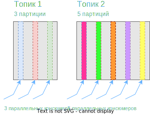
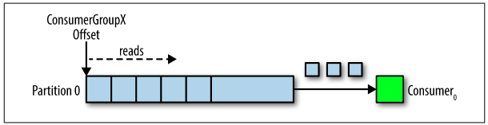
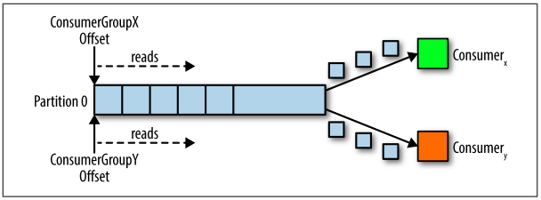
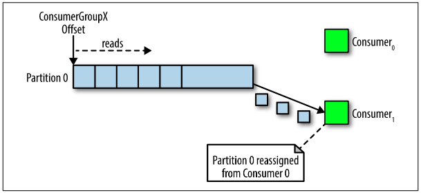
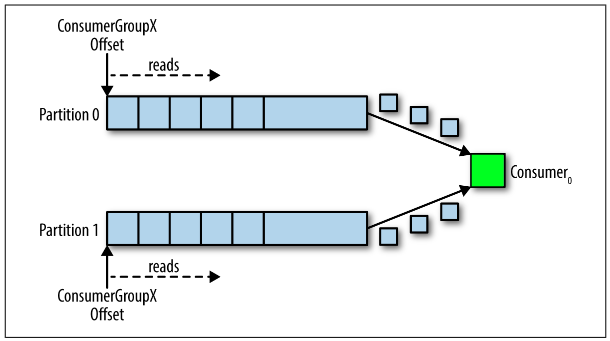
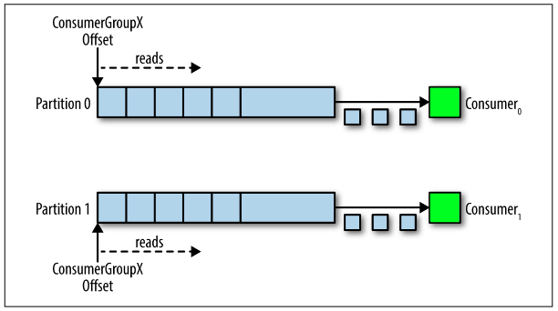

# Event Streaming

На русский примерно переводится как *потоковая передача событий*. Событие логически - это событие в прямом смысле слова, когда в какой-то программной\аппаратной системе что-то происходит. Например, пользователь пытается залогиниться на свою страницу в социальной сети или датчик температуры фиксирует ее изменение. И это событие всегда выражается какими-то данными. Например, попытка залогиниться - ip, mac-адреса, имя пользователя и пароль. Изменение температуры - идентификатор датчика, его гео-координаты, значение температуры. У события есть источник - в данных примерах это телефон пользователя и датчик. Примеры других источников - базы данных, различные программы и т.д.

Так вот ES - это *непрерывный сбор данных* от источников, *хранение* этих данных для дальнейшего извлечения, манипуляций и перенаправления в другие точки назначения.

# Kafka

## Что это

Apache Kafka - это платформа для потоковой передачи событый. Она обеспечивает все вышеуказанные возможности - публикация событий, их хранение и чтение. Кафка является распределенной системой, состоящей из серверной части и клиентской, общающихся по протоколу TCP.

> Распределенная система ("приложение", "программа") означает, что "программа" состоит из множества своих экземпляров, которые работают на разных серверах, обмениваются данными и таким образом формируют целую систему. Противоположность распределенной системе - монолит. Распределенная система лучше масштабируется и более отказоустойчива.

## Устройство: серверная и клиентская часть, брокеры

* Серверная часть: кафка работает на кластере серверов. В кластере может быть сколько угодно серверов - хоть один, хоть двадцать. Располагаться они могут где угодно. Часть серверов формирует *слой хранения* (storage layer), они называются *брокерами*.
* Клиентская часть: для кафки реализовано множество клиентов, которые позволяют писать\читать\обрабатывать потоки событий. Это позволяет пользователям кафки так же писать распределенные приложения.

## События, продюсеры, консюмеры

В терминах кафки событие, запись (record), сообщение - синонимы. Концептуально событие имеет ключ, значение и временную отметку. Продюсеры - это клиентские приложения, которые пишут события в кафку, а консюмеры - это клиентские приложения, которые читают события из кафки. Продюсер и консюмер полностью отзвязаны друг от друга. Пример события (концептуально):

```json
key: user1337
value: {
    type: "Приход"
    value: 200
    currency: "rub"
}
timestamp: "01.02.2023"
```

## Топики, партиции, репликация

События организуются и хранятся в *топиках* (topic). Топик таким образом - это логическая группировка событий. Например, топик может содержать положение множества автобусов на нескольких маршрутах в городе.

Каждый топик раздроблен на части (*партиции*, partitions) и каждая ~~часть хранится на отдельном брокере~~(а вот это не факт). События, имеющие одинаковый id, всегда сохраняются в одну и ту же партицию топика (но это не означает, что в партиции лежат только события с одинаковым id, могут лежать и с разным. Главное, что если id одинаковый, то эти события будут всегда в одной партиции, что дает гарантию чтения в той же последовательности, в которой они пришли).

С каждым топиком может быть связано сколько угодно продюсеров и консюмеров. Объемы данных на производительность не влияют. Поэтому можно хранить события сколь нужно долго, настраивать это самостоятельно. Кроме того, в кафке есть дополнительные средства, вроде обеспечения единократного чтения события, чтобы, например, оплата не прошла дважды.

Топики могут быть *реплицированы* между брокерами, т.е. несколько копий топика могут храниться на разных брокерах, повышая отказоустойчивость. Типичный фактор репликации - 3.

 

# В процессе расследования

## Топики и партиции

Топик - это *логически* единая очередь однотипных сообщений. При создании топика можно указать, из скольких *партиций* он будет состоять. Партиции можно представить себе как *физические* очереди, составляющие вместе единую логическую.

UPD. Не обязательно однотипных. Скорее, связанных друг с другом. А принцип связи уже дело бизнес-логики. Например, события "Игрок залогинился", "Игрок положил деньги на аккаунт", "Игрок сделал ставку", "Деньги списались с аккаунта", "Деньги поступили в призовой фонд" вполне могут лежать в одном топике и чисто внешне они вообще разные, но вместе составляют единый процесс. В общем, надо больше примеров разбирать, чтобы прояснить лучше.

Количество партиций определяет, сколько консюмеров могут параллельно читать топик.



> Минутка аналогии: топик можно представить себе как толстое бревно, вдоль которого насквозь просверлено несколько широких дырок. И через это бревно льют воду. Вода выливается снизу из каждой дырки. К этим дыркам можно подсоединить трубки - консюмеры. Одна трубка будет вести в таз, другая - в канаву, а третья - кому-нибудь в рот. Очевидно, что если дырок три, то четвертую трубку подключить будет некуда и единственный выход в этом случае - периодически перетыкать трубку. Следовательно, истинная параллельность подачи воды нарушается.
>
> В другое аналогичное бревно с пятью дырками можно лить не воду, а спирт. Лить одновременно и воду, и спирт - нельзя, потому что тогда это уже получится и не вода, и не спирт, а водка. Таким образом понимаем, что один топик содержит в себе только сообщения одного характера. Отправить конечно можно в топик все, что угодно, но логически это будет неправильно.

## Журнал коммитов

Each topic in Kafka has its own journal. > A Kafka journal is composed of multiple partitions =>

Мутный термин "Журнал коммитов" может мелькать там-сям во фразах вроде "Каждый топик имеет собственный журнал". При этом я нашел фразу "Журнал кафки состоит из множества партиций". Т.е. по сути можно логически приравнять термины "топик" и "журнал коммитов". Иже с ними идет "очередь". Все это суть одно - логически единая последовательность сообщений, физически разбитая на несколько очередей (партиций).

## Группа консюмеров (consumer group)

Предварительно о механике чтения из топика: есть указатель (синоним - *offset*), который указывает на сообщение в топике. При чтении указатель перемещается на следующее сообщение и т.д., идет вперед. Поскольку из топика могут читать несколько сервисов, то каждому из них очевидно нужен свой указатель. Потому что если сервис A прочитал 10 сообщений, а сервис B только начал работу, то если бы указатель был один, сервис B бы пропустил эти 10 сообщений. А если у каждого свой указатель, то проблем нет.

Так вот, группа консюмеров - это *несколько* консюмеров, пользующихся одним и тем же указателем. Таким образом формируется *логически* единый консюмер. Это может быть полезно, если характер работы позволяет обрабатывать сообщения параллельно. Например, какая-нибудь валидация данных. Здесь нет нужды даже в соблюдении какой-то очередности обработки, группировке, просто нужно убеждаться, что данные правильные. Соответственно, в сервисе можно создать несколько экземпляров консюмеров, которые параллельно будут тянуть сообщения, валидировать и слать куда-то еще например.

group_id

Когда консюмер соединяется с топиком, ему назначается партиция, из которой он будет читать, и оффсет. Консюмер сам может настроить этот оффсет - поставить его в начало очереди сообщений или в конец. В процессе чтения позиция оффсета регулярно коммитится в кафку в ее специальный внутренний топик __consumer_offsets. Консюмер может перепозиционировать оффсет и таким образом прочитать сообщения заново, если вдруг надо. Когда другой (логически другой) консюмер подсоединяется к топику, то ему назнается его собственный оффсет, и т.д.

В случае ошибок при чтении, отвала консюмера, логика повторного чтения потенциально пропущенных сообщений ложится на самих консюмеров, а не на брокера. ??? Стр 44 Грубо говоря, есть два сценария:

* Оффсет закоммитился до фактической обработки сообщения, а в процессе обработки произошел отвал. В итоге остальные консюмеры читают дальше, а сообщение по сути не обработано.
* Оффсет не коммитится до окончания обработки и ввиду параллельности, другой консюмер может прочитать то же сообщение, которое уже обрабатывается кем-то.

За подробностями перечитать С 44 и гугл.


## Сценарии чтения

### 1ЛК(1ФК) - 1П

1 логический консюмер, состоящий из одного физического, и топик с одной партицией.



Тут все просто - у консюмера свой оффсет и он читает из одной партиции.

### 2ЛК(1ФК) - 1П

2 логических консюмера, в каждом по одному фактическому, и топик с одной партицией.



У каждого логического консюмера свой оффсет, поэтому они спокойно читают сообщения независимо.

### 1ЛК(2ФК) - 1П

Один логический консюмер, состоящий из двух физических, и топик с одной партицией.



Физический консюмер, подключившийся последним, захватывает оффсет и начинает читать. Первый консюмер уже не может читать.

Предполагаю, что это сделано ради упрощения параллелизма. Нет общего состояния - нет проблем в параллельности. Общим состоянием в данном случае является оффсет.

### 1ЛК(1ФК) - 2П

Один физический консюмер читает из топика с несколькими партициями.



В этом случае консюмер просто управляет обоими оффсетами, только и всего. Про последовательность чтения сейчас сказать не могу, возможно по кругу просто читает.

### 1ЛК(2ФК) - 2П

Логический консюмер, состоящий из двух физических, читает топик, состоящий из двух партиций.



Самый эффективный сценарий. Партиции распределяются между физическими консюмерами один к одному и они читают параллельно каждый из своей партиции, управляя своим оффсетом.

### Вывод

Параллелизм чтения в кафке достигается за счет разбиения топика на партиции. Максимальная эффективность достигается, когда количество фактических консюмеров равно количеству партиций в топике. Если консюмеров меньше, чем партиций, значит какому-то консюмеру придется обрабатывать больше одной партиции. Если же консюмеров больше, чем партиций, значит какие-то консюмеры будут простаивать.

??? Как партиции распределяются по брокерам? Должны ли все партиции топика находиться на одном брокере?

## Запись

Сообщение в кафке, как уже выше писал, состоит из пары ключ-значение, плюс временная метка. В значение мы помещаем полезную нагрузку. Ключ как правило должен иметь бизнес-значение (например, id аккаунта клиента), потому что именно на основе ключа определяется, в какую партицию отправить сообщение. Если ключ одинаковый, то сообщения гарантированно попадут в одну и ту же партицию, а значит будут располагаться в ней ровно в том порядке, в котором были отправлены. Следовательно, и прочитаны тоже будут в порядке отправки.

Интерфейс Partitioner отвечает за определение партиции по ключу. Если ключ указан, то вроде берется его хэш и делится на количество партиций. Если ключ не указан, то добавление идет по кругу.

Можно писать свои реализации для определения нужной партиции. В каких случаях может понадобиться - пока не ясно.

Нужно учитывать, что сообщения отправляются не сразу, а сперва собираются в буфер (??? это и есть пакеты (batch)?) и потом отправляются в фоновом потоке. Поэтому плохо написанное приложение может терять сообщения. Метод отправки возвращает Future. Можно настроить размер буфера равным 0 и при отправке на полученном Future вызывать .get(), что заставит отправляющий тред ждать ответа от брокера. Таким образом можно увеличить надежность ценой производительности.

# Конспект "Кафка в действии"

Кафка изначально ориентирована на работу с несколькими потребителями. Поэтому в ней есть по умолчанию возможность повторного чтения сообщений. Так что один и тот же потребитель (или несколько потребителей) могут прочитать одно и то же сообщение без проблем. В других системах такая возможность может отсутствовать или быть сложнореализуемой.

Кафка поддерживает параллельную работу. Несколько потребителей одного и того же топика могут работать параллельно.

Кафку удобно использовать для логов. Логи пишутся в темы, а интересующиеся этими логами их читают.

Кафку можно использовать как альтернативу REST для взаимодействия микросервисов. Один мс может писать сообщения, другой - читать. Первому уже не придется дергать эндпоинт второго, чтобы передать данные. К тому же в случае, когда второй мс лежит, это может быть удобнее, т.к. он прочитает сообщение сразу как встанет, а первому для этого не придется ничего делать.

Кафку можно настроить так, чтобы она позволяла производителям отправлять одно и то же сообщение многократно и передавала их брокерами:

> Что здесь понимается под кафкой, если брокер идет отдельным упоминанием?
>
> Может быть кафка тут - это система в целом. Она ведь наверняка состоит из множества компонентов, а брокеры - только один из них. И вероятно сообщение идет не в брокера напрямую, а в какой-нибудь "распределитель", а из него - уже в брокеры. Но это только догадки.

* at least once semantic (ALOS) - "не менее одного раза" - продюсеру разрешено слать одно и то же сообщение несколько раз, до тех пор, пока он не получит от брокера подтверждение о получении (брокером) сообщения. Т.о. могут возникнуть дубли сообщения и все они уйдут консюмеру.
* at most once semantic (AMOS) - "не более одного раза" - продюсер может послать сообщение только единожды. Если сообщение не дошло - значит не повезло, и консюмер вообще ничего не получит в итоге.
* exactly once semantic (EOS) - "точно один раз" - продюсер может слать одно и то же сообщение несколько раз, до получения подтверждения от брокера (как в первом сценарии), однако на этот раз брокер позаботится о дублях и консюмеру придет только один экземпляр сообщения.

В сообщения можно добавлять заголовки.

Один сервер может держать одного брокера. Если использовать виртуалки, то одна виртуалка - один брокер. Несколько брокеров формируют кластер.

Создавать темы можно с помощью готовых скриптов.

Топик можно разбить самостоятельно на желаемое количество партиций.

> Возможно, оно как-то связано с количеством брокеров. В книге использовалось 3 брокера и били на 3 партиции.

Параметры создания:

```
--partitions
--replication-factor - сколько копий каждой партиции будет существовать
--bootstrap-server - адрес брокера
```

Когда речь идет о репликах, есть понятие *leader*, ведущая реплика. Именно в нее пишутся сообщения, а остальные реплики просто копируются с нее. Более формально - остальные реплики являются подписчиками лидера. Когда нет сбоев, консюмеры и продюсеры взаимодействуют только с лидером. Система ориентируется в том, какая реплика является лидером, с помощью ZooKeeper.

Кстати, хорошее определение топика, это - очередь сообщений в брокере, имеющая логическое имя.

Консюмеры бесконечно проводят опрос брокеров, пока существуют.

> ??? Может ли один топик быть разбит на 3 партиции и при этом быть только один брокер? Т.е. на одном брокере хранится 3 партиции одного топика.
>
> Мне кажется, что нет. Потому что пока складывается впечатление, что брокер - это единица параллельной работы. Т.е. сколько брокеров, столько и параллельных обработок. Партиция по ощущениям нужна как раз для того, чтобы распараллелить работу продюсеров и консюмеров, чтобы им по возможности не приходилось работать с одним и тем же файлом (ведь партиция это вроде как файл на диске)
>
> UPD. Количество партиций топика не связано с количеством брокеров напрямую. В топике может быть хоть 20 партиций, а брокер только один. Степень параллельности зависит как раз от количества партиций, потому что механика чтения предполагает, что идеальный сценарий - "количество консюмеров = количеству партиций". Два консюмера, логически представляющие один консюмер, не могут читать одну и ту же партицию одновременно.

> ??? "Реплика с одним разделом существует только в одном брокере и не может разбиваться между брокерами" Вот тут не опечатка ли? Мб "Тема с одним разделом"? Чек в оригинале
>
> A single partition replica only exists on one broker and cannot be split between brokers.
>
> Вообще не понятно как это понимать. То ли действительно "реплика с одним разделом", то ли "реплика единственного раздела", то ли еще как-то. Реплика ведь не может биться на части? Реплика существует только для целой партиции и несколько копий размещаются на нескольких брокерах?

> ??? Если ведущая реплика раздела может быть только на одном брокере, то может ли один брокер хранить несколько ведущих реплик партиций, относящихся к разным топикам?
>
> Как по мне, то может.

ZooKeeper нужен для "координации". Одним из примеров координации является определение того, какой брокер хранит ведущую реплику партиции. ZooKeeper тоже является распределенной системой и обычно работает на нескольких серверах (а вот это проверить бы)


# Из интернета

* При отправке в брокер сообщений, продюсер может отправлять их не сразу, а организовывать в пакеты (batch) и отправлять целиком пакет, что снижает нагрузку на сеть. К тому же продюсер самостоятельно решает, в какую именно партицию отправить сообщение \ пакет. Это происходит примерно следующим образом:
  * Если у сообщения нет id, то партиция выбирается "по кругу". Допустим, у нас 10 партиций и мы записываем 15 сообщений без id. Тогда 1 сообщение попадет в 1 партицию, 2 во вторую и т.д. до десятой. 11 попадет снова в 1, 12 во вторую, а 15 - в 5 партицию.
  * Если у сообщения есть id, то его хэш делится на количество партиций и т.о. определяется целевая партиция. В общем, принцип как при поиске индекса в хэш-таблице.
  * Для сообщения можно явно указать партицию, в которую его надо поместить.

* *У каждого топика в Kafka есть свой журнал.*
   Продюсеры, отправляющие сообщения в Kafka, дописывают в этот журнал, а  консюмеры читают из журнала с помощью указателей, которые постоянно  перемещаются вперед. Периодически Kafka удаляет самые старые части  журнала, независимо от того, были ли сообщения в этих частях прочитаны  или нет. Центральной частью дизайна Kafka является то, что брокер не  заботится о том, прочитаны ли сообщения или нет — это ответственность  клиента.

## Журнал коммитов

Из кафки в действии скрин:


Не понятно, почему три бибы нарисовано. То ли это этапы, типа было пять сообщений, потом добавили шестое (вторая биба) и потом - седьмое. Сколько у темы журналов? Один? Как журнал связан с партициями?

Each topic in Kafka has its own journal

Producers that send messages to Kafka append to this journal, and
consumers read from the journal through the use of pointers, which
are continually moved forward. Periodically, Kafka removes the old‐
est parts of the journal, regardless of whether the messages contained within have been read or not. It is a central part of Kafka’s
design that the broker is not concerned with whether its messages
are consumed—that responsibility belongs to the client.

# Ссылки

Что можно почитать:

* https://habr.com/ru/post/466585/
* 

# Интересное

* "Чтобы создать кластер Kafka, нужно настроить три сервера (брокера): server0, server1 и server2" (с.293 Кафка в действии) - ага, т.е. сервер кафки называется брокером.
* При попытке в кластере из двух брокеров создать топик, разбитый на 5 партиций и реплик-фактором 3, offset explorer дал ошибку "Replication factor: 3 larger than available brokers: 2". Т.е. очевидный вывод - максимум реплик для партиции равен количеству брокеров. А вот 5 партиций его не смутили.


# Классы

Которые попались при чтении разных книг:

```
RecordMetadata
ProducerRecord
Partitioner (interface)
ConsumerRecords и ConsumerRecord
```


# Вопросы

* Говорят, что партиции - это основной способ параллельной работы. Но каким образом? Если у нас один брокер, а мы все равно можем разбить топик например на 10 партиций, то как это поможет параллельной работе?
* Про термин offset бы выяснить еще