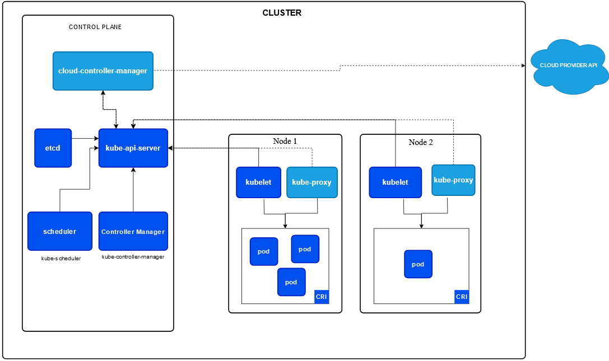
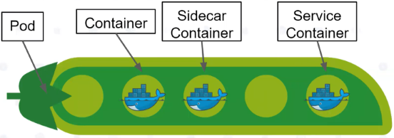

# Материалы

* https://kubernetes.io/docs/concepts/overview/components/
* https://habr.com/ru/companies/nixys/articles/480072/
* https://www.uffizzi.com/kubernetes-multi-tenancy/kubernetes-controllers
* 

# Термины

Для которых надо бы найти определение:

* Kubernetes object. https://kubernetes.io/docs/concepts/overview/working-with-objects/

Кубер - это оркестратор контейнеров. Его задача - управлять множеством контейнеров, которые запущены на *разных* машинах (физических или виртуальных).

# Архитектура kubernetes

Логически, систему кубера можно разделить на несколько компонентов.

## Node

Нода - это, грубо говоря, компонент, в котором крутится контейнер. Каждая нода - это отдельная физическая или виртуальная машина. Несколько нод формируют кластер.

В состав ноды входят несколько компонентов:

* container runtime interface - это система, в которой крутится Pod. По сути, этой системой является Docker.
  * Pod - это вместилище контейнера. Внутри пода уже непосредственно крутится docker-контейнер. В одном поде мб несколько контейнеров, но как правило там один. Несколько их бывает только в случаях, когда "основному" контейнеру (нашему приложению) требуется что-то дополнительное.
* kubelet - это компонент, который связывает ноду с Control plane. Он, вероятно, вытягивает из нее спецификации подов, запускает их и контролирует, что они работают нормально.
* kube-proxy - компонент, который организует связь ноды с внутренним или внешним (по отношению к кластеру) сетевым трафиком.

### Pod

Технически пока не знаю как описать под. Вроде бы изначально это просто "запрос", текстовое описание в yaml файле, вроде файла конфига, из которого кубер и разворачивает под. Pod переводится как "стручок" (гороховый). Канонично в поде размещается один "главный" контейнер, который выполняет основную работу (например, экземпляр микросервиса), плюс могут быть и другие контейнеры для вспомогательных функций, например сбор аналитических данных и т.д.

Под воспринимает себя как отдельный компьютер, соответственно, все контейнеры, которые крутятся внутри пода, делят его ресурсы между собой.

Визуализация пода:

* Container - наш микросервис.
* Sidecar container - какой-нибудь вспомогательный контейнер, который мы добавляем для аналитических \ прочих целей.
* Service container - обязательный системный контейнер, который кубер автоматически добавляет в каждый под. С помощью него кубер может отслеживать состояние пода и обеспечивать сетевое взаимодействие.

## Control plane

Еще называется "мастер нода". Занимает отдельную машину в кластере. Является мозгом кластера, отслеживает события, происходящие в нем и реагирует на них. Выполняет разные задачи, которые распределены между несколькими компонентами.

### kube-apiserver

Является точкой взаимодействия с мастер-нодой. Выставляет свои возможности через api.

### kube-controller-manager

У кластера есть текущее состояние и т.н. "желаемое" состояние (current state и desired state). Задача контроллера - отследить ситуацию, когда они разошлись и вернуть текущее состояние к желаемому. Контроллеры бывают разные. Некоторые принимают самостоятельные действия для выправления состояния, а некоторые обращаются к api мастер-ноды.

Контроллер еще имеет название "control loop". Каждый контроллер как правило наблюдает за каким-то одним аспектом состояния.

Примеры контроллеров, встроенных в кубер: DaemonSet, Deployment, Service, StatefulSet, Node Controllers.

TODO: найти, чем выражено состояние и что в кубере понимается под термином "ресурсы", кроме очевидных вроде cpu и памяти.

### cloud-controller-manager

кубер можно развернуть на собственных серверах, +заказать облачный кубер, а этот компонент нужен, чтобы два кластера могли обмениваться информацией. В России кубер обычно разворачивают на собственных серверах, облаками не пользуются.

### etcd 

Хранилище типа "ключ-значение", в котором кубер хранит все данные о кластере. Например, текущее состояние, параметры желаемого состояния.

### kube-scheduler 

Наблюдает за новыми созданными подами и решает, в какую ноду определить под.

Технически, эти компоненты могут располагаться на разных машинах кластера, но как правило находятся на одном.

Для устойчивости кластера должно быть минимум три мастер-ноды, чтобы работала репликация и в случае сбоев можно было восстановить состояние кластера. При увеличении количества нод будет расти и количество мастер-нод. TODO: почему?

Не является непосредственно "панелью управления", в которой пользователь может пощелкать какие-то кнопки. GUI это отдельная история и он связывается с мастер нодой через ее api.

# Прочая терминология

"Рабочие нагрузки"

* Replica Set - одна из сущностей кубера, тоже описывается в yaml. Суть вроде в том, что она несколько экземпляров одного и того же пода может поднять.
* Deployment - одна из сущностей кубера, тоже описывается в yaml. Как будто бы описывает всю систему в целом, все поды и т.д.
* Jobs

Все эти вещи могут выражены подами.

# Дополнительно

Кроме Docker существуют и другие системы контейнеризации. Кубер постепенно отказывается от Docker runtime, но контейнеры докера могут работать и в других рантаймах.

## Программы

Программы, которые будут полезными для работы с кубером:

* Minikube - это "кубернетис в контейнере", программа позволяет потрениться с кубером на локальном компьютере.
* Балансировщики, ingress используются для вывода трафика из пода наружу?
* mRemoteNG - позволяет удаленно подключаться к программам, есть вкладки.