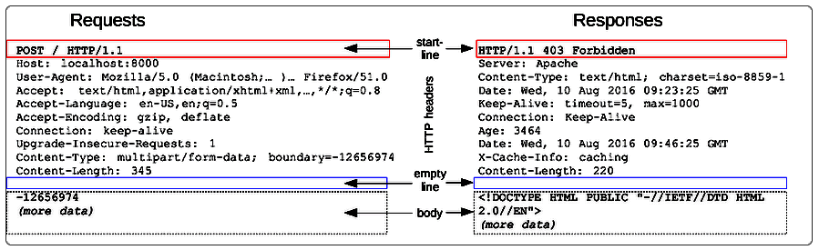

# Версии HTTP и спецификация

У HTTP есть [спецификация](https://www.rfc-editor.org/rfc/rfc9110#name-introduction).

[История](https://developer.mozilla.org/ru/docs/Web/HTTP/Basics_of_HTTP/Evolution_of_HTTP) знает 4 версии протокола Http:

* 0.9 - Примерно 1990 год. Во времена ее использования собственно версии вообще не было, а 0.9 придумали уже потом, после выхода других версий, просто чтобы различать.
* 1.0 - 1996 год.
* 1.1 - 1999 год.
* 2.0 - 2015 год.

Кроме технических улучшений и оптимизаций, в версии 2.0 сам запрос перестал быть обычным текстом и приобрел двоичную форму. Так что теперь его просто так не почитать.

# Структура HTTP

Итого 4 ключевых элемента:

* **"Первая строка"**

  В запросе это - глагол, url и версия протокола

  В ответе это - версия протокола, статус-код, статус-сообщение

  Т.е. каждый элемент отделен пробелом

* **Заголовки**

  Это дополнительная информация, помогающая серверу обработать запрос. Начинаются со второй строки, и до пустой строки. Про заголовки написано отдельно.

* **Пустая строка**

  Служит признаком того, что после нее начинается тело.

* **Тело**

  Данные произвольной длины, "нагрузка" (payload) запроса. Тело есть у любого запроса. Хотя принято разделять запросы на основе используемого метода, например POST или GET, и считать, что некоторые запросы тела не имеют (например, GET), но технически это не так. Технически они тоже могут иметь тело, но вот как с этим фактом считаться - в разное время были разные мнения. В старой спецификации серверам предписывалось игнорировать тело, если метод запроса - GET. В современной спецификации это предписание убрано. Одним словом, все запросы с технической точки зрения структурно одинаковые.