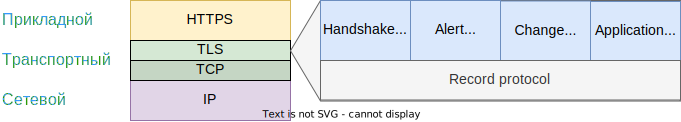
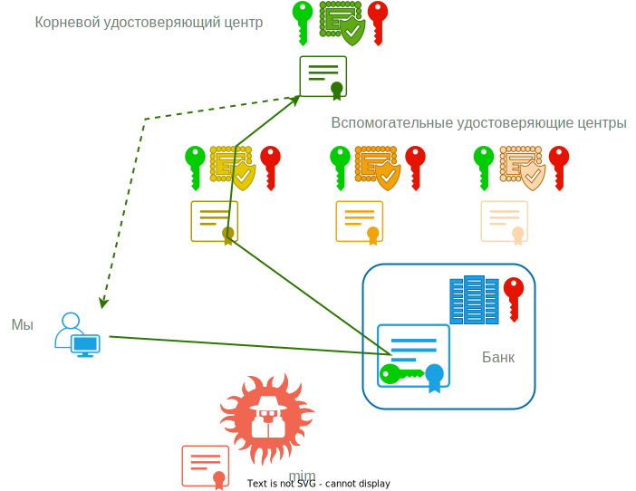

# TLS и SSL, HTTPS, TCP

SSL (Secure Socket Layer) и TLS (Transport Layer Security) - это протоколы, цель которых - обеспечить защищенную передачу данных по незащищенному каналу связи. Защищенная передача не означает, что данные нельзя перехватить, она означает, что данные передаются в зашифрованном виде, из-за чего в случае перехвата их все равно не так-то просто или даже невозможно расшифровать.

SSL - старый протокол, отживший еще в 90е. TLS - его продолжение, но из-за того, что название SSL прижилось, то оно сейчас может использоваться как синоним TLS, в частности, в названии библиотек.

TLS находится между HTTPS и TCP - приходящая от HTTPS информация шифруется и уходит к TCP:

# Проблема "Человек посередине"

Чтобы упростить восприятие процесса, будем пользоваться терминами "мы", "банк", "пакет", "зайти на сайт". "Мы" - это будет любой клиент (программа, браузер и т.д.), устанавливающий соединение с каким-то сервером, условным "банком". А "пакет" - это данные, которые идут между нами и банком. "Зайти на сайт" будет означать не обязательно заход на какой-то сайт в прямом смысле слова, а просто установку любого соединения между кем угодно.

Когда мы соединяемся с банком, то наверняка не можем знать, что соединились именно с банком. И дело не в том, что мы зашли на какой-то поддельный сайт, а в том, что даже если сайт правильный, то все равно пакет может быть перехвачен "человеком посередине" (man-in-the-middle, mim, "мим" далее для краткости). Мим перехваченный пакет анализирует, затем сам устанавливает с банком соединение, и передает ему наш пакет, а затем получает ответ от банка и передает его нам. Суть атаки MitM в том, что *непосредственно* мы общаемся не с тем, с кем думаем, и не подозреваем об этом. Мим может модифицировать пакеты или просто собирать информацию, но не в этом суть, а в появлении в общении нелегального посредника, который видит содержимое пакета.

Избежать появление мима невозможно, однако качественное безопасное соединение означает не исключение появления мима, а то что перехват пакетов становится по сути бесполезным за счет того, что они зашифрованы и есть механизм проверки их целостности. Шифровка означает, что прочитать их невозможно, а проверка целостности исключает модификацию пакета.

TODO: мим - это результат того, что трафик в сети проходит через множество промежуточных узлов, над которыми злоумышленник может иметь контроль.

Но чтобы все это работало, мы все равно должны как-то договориться с банком о правилах шифрования.

# Общая схема работы TLS

Безопасность в TLS подразумевает три вещи:

* Аутентификацию - мы должны точно знать, что устанавливаем безопасное соединение именно с банком. Иначе мы просто договоримся о правилах шифрования с мимом, и все так же будем слать ему пакеты, хоть и шифрованные, которые он очевидно сможет расшифровать.
* Шифрование данных - если нам удалось установить безопасное соединение именно с банком, тогда шифрование данных сделает их чтение невозможным для мима.
* Проверка целостности данных - если нет проверки целостности, то мим сможет модифицировать пакеты. TODO: Возможно, благодаря шифровке, эти модификации подразумевают не подмену содержимого пакета, а только его обрезку, но тем не менее, любая модификация является потенциальной угрозой.

Все эти компоненты безопасности достигаются за счет применения *гибридного* шифрования - например, аутентификация использует ассиметричный подход, а шифрование и проверка целостности - симметричный. Ассиметричные алгоритмы довольно медленные, но зато надежнее симметричных по своей концепции работы, и поэтому используются, по сути, единожды - только при установке безопасного соединения. Потом же, когда соединение установлено, все шифрование данных происходит с помощью симметричных алгоритмов, которые намного быстрее.

Напоминание:

* Симметричное шифрование - предполагает, что для шифровки \ расшифровки используется одинаковый ключ.
* Ассиметричное шифрование - используется пара ключей - открытый и закрытый (ОК и ЗК). Данные, зашифрованные ОК, могут быть расшифрованы только ЗК, и наоборот - зашифрованное с помощью ЗК, расшифровывается только ОК.

Общая идея установки безопасного соединения через TLS выглядит так:

* Клиент и сервер договариваются об алгоритмах, которыми будут пользоваться для шифрования. Т.к. алгоритмов существует несколько и клиент и сервер могут поддерживать разные, то необходимо этот момент согласовать.
* Клиент убеждается в том, что общается действительно с сервером, а не с мимом. Сервер при необходимости тоже может убедиться в том, что клиент - это не мим. И то, и то делается с помощью *сертификатов*.
* Клиент и сервер обмениваются разными вспомогательными сообщениями, которые позволяют им выработать два *общих секрета* (иначе говоря, *ключа*) - один будет использоваться для шифровки самих данных, а другой - для формирования *MAC* (Message Authentication Code, не путать с MAC-адресом).
* Клиент и сервер начинают обмен зашифрованными данными, которые мим все еще может перехватить, но не в состоянии ни прочитать, ни корректно модифицировать, т.к. у него нет ключей, которые клиент и сервер выработали на этапе установки соединения, поэтому перехват бесполезен.

Детализация шагов зависит от используемых алгоритмов и версии протокола TLS.

Концептуально TLS не задает жестких ограничений по используемым алгоритмам. Он дает возможность серверу и клиенту договориться насчет алгоритмов и таким образом обеспечивает необходимую гибкость, ведь протоколы развиваются, меняются, становятся более надежными и такое отсутствие привязки очень важно в перспективе.

Однако по мере выявления уязвимостей в алгоритмах, некоторые запрещаются к использованию. Например, в TLS 1.3 запрещено использование RSA, а в TLS 1.2 он в ходу. Использовать можно только комбинации шифров, признанные безопасными. Именно комбинации, потому что если каждый алгоритм для своей части обеспечивает надежность, например, один хорошо подходит для шифрования данных, а второй - для mac, то не факт что комбинация этих шифров даст безопасность для всего процесса шифрования сообщения в целом.

# Схема работы TLS на примере версии 1.2

# Дополнительно

## Сертификаты

Работа сертификатов основана ассиметричном шифровании. Напомним основную идею АШ: генерируется пара ключей - открытый и закрытый (ОК и ЗК). Данные, зашифрованные ОК, могут быть расшифрованы только ЗК, и наоборот - зашифрованное с помощью ЗК, расшифровывается только ОК.

Общая схема функционирования системы аутентификации на основе сертификатов:

Сертификат представляет собой набор различных данных, среди них, например:

* Какой УЦ выдал этот сертификат
* Для какого домена выдан этот сертификат
* Когда истекает срок сертификата
* Статус сертификата - отозван или действующий
* И т.д.

Удостоверяющий центр (УЦ), который выдает сертификат, шифрует его своим закрытым ключом ("подписывает"), а значит проверить подлинность сертификата (расшировать его) можно с помощью открытого ключа этого же УЦ. Соответственно, схема работы получается такая:

* Банк обращается в ВУЦ, чтобы ему выпустили сертификат
* ВУЦ генерирует сертификат и отдает его банку
* Когда мы соединяемся с банком, он дает нам свой сертификат
* Поскольку в сертификате есть информация о ВУЦ, который его выдал, мы можем обратиться к этому ВУЦ, чтобы узнать, действительно ли он выдавал такой сертификат, не просрочен ли он и действительно ли выдан банку
* Чтобы убедиться, что мы запрашиваем эту информацию действительно у ВУЦ, а не у мима, ВУЦ тоже использует сертификат. Соответственно, мы с помощью информации из сертификата ВУЦ обращаемся уже к корневому УЦ, у которого тоже есть сертификат. И тут возникает вопрос - а как понять, что мы общаемся с корневым УЦ, а не с мимом? Дело в том, что сертификаты корневых УЦ встроены в браузеры или в операционные системы, так что полученный от корневого УЦ сертификат нам есть с чем сравнить
* Таким образом мы проверяем подлинность сертификата, который нам прислал банк
* Если сертификат подлинный и судя по информации в нем действительно выдан тому домену, к которому мы обратились (банку), то мы общаемся действительно с банком и можем продолжать налаживать безопасное соединение
* Дальнейшие шаги зависят от выбранных алгоритмов шифрования. Например, внутри сертификата банка может лежать открытый ключ банка. Мы можем сформировать *пре-мастер секрет*, зашифровать его этим открытым ключом и отправить банку, не боясь, что мим расшифрует пакет (исходя из того, что у него нет закрытого ключа банка)

Есть так называемые *самоподписанные сертификаты*. Это когда сервис сам генерирует сертификат и шифрует его своим закрытым ключом. Все сертификаты корневых УЦ являются самоподписанными, т.к. они находятся в основе иерархии и никто другой кроме них самих не может подписать их сертификаты. Поэтому такие сертификаты и встраиваются в ОС или браузер как гарантия их надежности. Без такой меры мим мог бы создать самоподписанный сертификат, вклиниться на этапе запроса к УЦ и выдать себя за УЦ. Но поскольку сертификат мима не может оказаться в хранилище сертификатов браузера или ОС, то мим не может притвориться УЦ. А вот "обычные сайты", которые используют самоподписанные сертификаты, по сути никак не защищены от мима.

## Алгоритм Диффи-Хеллмана

Это алгоритм, который с помощью нескольких общедоступных чисел $g$ и $p$ по математической формуле $g^n \mod p$ позволяет получить *независимо* на клиенте и сервере одинаковое число. Это число можно использовать как основу для генерации общего ключа, с помощью которого шифровать данные при передаче. При этом раз число получается независимо, его нет необходимости передавать по сети, а значит злоумышленник никак не может его узнать.

> Напоминание: mod это остаток от деления. 14 mod 3 = 2
>
> * 14 / 3 = 4.6(6)
> * 3 * 4 = 12
> * 14 - 12 = 2

* Клиент и сервер обмениваются парой случайных чисел $g$ и $p$. Например, их генерирует сервер и высылает клиенту. Пусть для примера $g=3$ и $p=29$
* Клиент и сервер генерируют по случайному числу $n$, пусть 5 и 8 соответственно. Эти числа они оставляют при себе
* Каждый применяет вышеуказанную формулу, используя свое число (5 и 8):
  * Клиент: $3^5 \mod 29 = 243 \mod 29 = 11$
  * Сервер: $3^8 \mod 29 = 6561 \mod 29 = 7$
* Полученными числами 11 и 7 они обмениваются и применяют в формуле $Y^n \mod p$, где $Y$ - это число, полученное от товарища:
  * Клиент, получив 7 от сервера: $7^5 \mod 29 = 16.807 \mod 29 = 16$
  * Сервер, получив 11 от клиента: $11^8 \mod 29 = 214.358.881 \mod 29 = 16$
* Таким образом, клиент и сервер получили независимо одинаковое число - 16. Злоумышленник не может его никак узнать, поскольку оно по сети не передавалось, и загаданные изначально 5 и 8 тоже. Соответственно, на основе этого числа можно безопасно сгенерировать ключ для использовать в симметричном шифровании данных.

Реально используемые числа конечно же гораздо больше.

## Совершенная прямая секретность

Подразумевает, что даже если передаваемые данные перехвачены и сохранены, то злоумышленник не сможет их расшифровать, даже если потом получит доступ к серверу.

Некоторые алгоритмы и схемы работы не дают спс. Например, мы используем алгоритм RSA. Тогда схема установки безопасного соединения выглядит так:

1. Клиент и сервер договариваются об алгоритмах, обмениваются случайными числами и т.д.
2. Клиент получает сертификат сервера, извлекает из него открытый ключ сервера
3. Клиент генерирует премастер-секрет, шифрует его ОК и передает серверу
4. Сервер расшифровывает пакет и получает премастер-секрет
5. Клиент и сервер генерируют общие секреты на основе премастера и случайных чисел из п.1 и начинают обмен
6. Злоумышленник сохраняет все пакеты, но пока не может их расшифровать
7. Через какое-то время он каким-то образом получает доступ к серверу, ему удается получить закрытый ключ сервера
8. Он расшифровывает сообщение из п.3, узнает премастер-секрет и на основе информации из п.1 тоже может сгенерировать ключи, а значит теперь может расшифровать все сохраненные пакеты

А вот например использование алгоритма Диффи-Хеллмана дает спс (только ephemeral версия, а статическая - не дает) за счет того, что в обмене не используются *статические* значения, вроде открытого ключа из сертификата, а при установке нового соединения генерируются уникальные элементы, нужные для шифрования.

## MAC

MAC, когда речь идет о проверке целостности данных, означает *Message Authentication Code*, не путать с MAC-адресом. MAC получается следующим образом:

* Данные пропускаются через криптохэш-функцию, получается хэш
* Комбинация (хэш + ключ) еще раз пропускается через криптохэш и получается MAC. Применительно к TLS, используется два ключа. Один - для шифровки данных, а второй - как раз для формирования MAC.

Таким образом, злоумышленник, не зная ключа, не может сгенерировать корректный MAC. Сервер же, зная ключ, может вычислить MAC и путем сравнения с пришедшим МАС'ом проверить целостность данных.

