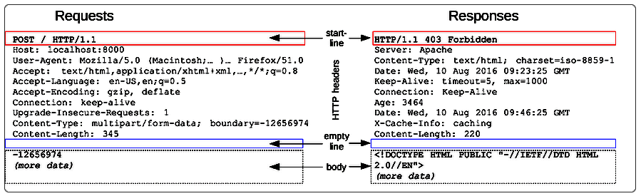

# Структура Http

[История](https://developer.mozilla.org/ru/docs/Web/HTTP/Basics_of_HTTP/Evolution_of_HTTP) знает 4 версии протокола Http:

* 0.9 - Примерно 1990 год. Во времена ее использования собственно версии вообще не было, а 0.9 придумал уже потом, после выхода других версий, просто чтобы различать.
* 1.0 - 1996 год.
* 1.1 - 1999 год.
* 2.0 - 2015 год.

Кроме технических улучшений и оптимизаций, в версии 2.0 сам запрос перестал быть обычным текстом и приобрел двоичную форму. Так что теперь его просто так не почитать. Но по сути вот так примерно выглядит формат Http:



Итого 4 ключевых элемента:

* "Первая строка"

  В запросе это - глагол, url и версия протокола

  В ответе это - версия протокола, статус-код, статус-сообщение

  Т.е. каждый элемент отделен пробелом

* Заголовки - дополнительная информация, помогающая серверу обработать запрос. Располагается, начиная со второй строки, и до пустой строки. Про заголовки написано отдельно.

* Пустая строка - служит признаком того, что после нее начинается тело (если тип запроса предполагает его наличие. Например, у GET нет тела, а у POST - есть)

* Тело - данные произвольной длины, "нагрузка" (payload) запроса

# Http - stateless протокол

Http - это stateless протокол ("протокол без сохранения состояния"). Это значит, что каждый запрос, даже если он приходит от одного и того же клиента, сервер рассматривает как самостоятельную отдельную единицу. В stateful протоколах (например, FTP) каждый запрос от одного и того же клиента рассматривается именно как часть цепочки запросов. Тем не менее, в Http конечно же есть средства для связи между запросами, благодаря чему мы можем, например, оставаться авторизованными на сайте в течение долгого времени. Просто эта связь между запросами реализуется передачей в каждом запросе дополнительной информации, которая позволяет серверу понять, что эти запросы связаны.

# Заголовки

О заголовках нужно думать относительно того, кто шлет запрос\ответ. Есть заголовки общие, а есть специфичные для клиента\сервера.

* *Accept* - клиентский, указывает формат данных, который клиент ожидает\предпочитает получить в ответе. Например, json.
* *Content-type* - общий, формат данных, который пересылается ???в теле??? в запросе.
* *Content-Length* - общий, длина данных, расположенных в теле.
* *Set-Cookie* - серверный. Если браузер видит в ответе от сервера этот заголовок, то создает и сохраняет у себя куку с указанным значением и параметрами.
* *Host* - клиентский, нужен, когда в url явно не указан хост (как так может быть - отдельная тема). Если хост в url указан, то этот заголовок игнорируется. Заголовок Host должен быть только один, иначе обычно возвращается код 400 (Bad Request). Если порт не указан, то для Http используется порт 80 по умолчанию, а для Https - 403.

# Куки

В основном взято [отсюда](https://developer.mozilla.org/ru/docs/Web/HTTP/Cookies)

## Что такое куки

Куки - это данные (обычно небольшое количество) вспомогательного характера, которые передаются между браузером и сервером. 

## Как куки создаются

Впервые кука создается в браузере. В общих чертах процесс возникновения куки выглядит так:

* Браузер посылает на сервер запрос
* Сервер возвращает ответ, в котором, среди прочих заголовков, может присутствовать заголовок *Set-Cookie*
* В этом случае браузер понимает, что надо создать куку
* Он ее создает и хранит у себя, и отправляет на сервер (в заголовке *Cookie*) с каждым очередным запросом

## Время жизни кук

По времени жизни куки делятся на два вида:

* Permanent cookie ("со сроком годности") - существуют заранее определенный промежуток времени, в течение которого браузер продолжает их хранить и отправлять, а по истечении этого промежутка - удаляет.

  Браузер создает такие куки, когда сервер присылает куку с заголовком *Expires* или *Max-Age*. В первом случае указывается дата и время, по какое существует кука. Во втором - количество секунд.

* Session cookie - существуют и отправляются, пока идет активный обмен между браузером и сервером. Когда активный обмен заканчивается (например, закрыли браузер), такие куки удаляются. Но в браузерах обычно есть опция "восстановления сеанса", при которой куки не удаляются и сеанс длится как бы бесконечно.

## Формат кук

Вот пример заголовка, содержащего куки:

```
Set-Cookie: key1=value1; expires=Mon, 17-Jul-2017 16:06:00 GMT; Max-Age=31449600; Path=/; secure
Set-Cookie: key2="value2"; Max-Age=31449600; Path=/; secure; SameSite=Strict; HttpOnly
```

Как видно, сервер может отдавать несколько заголовков Set-Cookie, чтобы браузер сохранил не одну куку, а сколько нужно. Куки хранятся в формате ключ-значение, причем значение может быть заключено в кавычки, если надо. После этого идут дополнительные параметры куки - например:

* Время жизни (Max-Age или expires)
* Запрет получать значение куки через Javascript (HttpOnly)
* Возможность отправлять куку только через Https с использованием SSL (sercure)

 Параметров довольно много, это отдельная тема.

# CORS

В 1995 году в браузере Netscape Navigator появилась концепция Same-origin Policy ("политика одного источника"). Если грубо и без деталей, то она про то, что если страница, загруженная с сервера А, захочет как-то взаимодействовать с другой страницей\ресурсом, которая\ый находится другом сервере В, то браузер такой запрос не выполнит (или сервер В этот запрос отклонит). Сделано это для безопасности. Под "как-то взаимодействовать" понимаются самые разные вещи, например, отправка запроса к этой странице, загрузка файла со стилями.

Наивный, но наглядный пример: есть какой-нибудь сайт A, требующий авторизации. Пользователь на этом сайте зарегистрирован и авторизован (его браузер сохранил куки). Злоумышленник на своем сайте B размещает страницу, в которой кроме всего прочего есть скрипт, отправляющий запрос на удаление аккаунта на сайте А. Так что как только пользователь заходит на сайт В и страница загружается, то срабатывает скрипт, отыскивает нужные куки и отправляет запрос удаления аккаунта на сайт А. Все, аккаунта нет.

С политикой одного источника такое невозможно. Однако есть множество случаев, когда такая политика слишком строга. Например, многие сайты собирают новости с других сайтов, показывают картинки\содержимое, которые тоже находятся в других источниках. Поэтому и существует **CORS** (Cross-Origin Resource Sharing), который дает гибкости и позволяет настроить условия взаимодействия между разными ресурсами.

# POST

Есть несколько вариантов передачи данных в теле, кроме привычного json:

* *x-www-form-urlencoded*

  Данные в теле выглядят как обычная url строка с параметрами:

  ```
  source=en&target=ru&text=Hello%20world
  ```

  Все символы, которые не цифры и не латинские буквы, кодируются через percent encoding, поэтому этот способ не подходит для передачи двоичных данных.